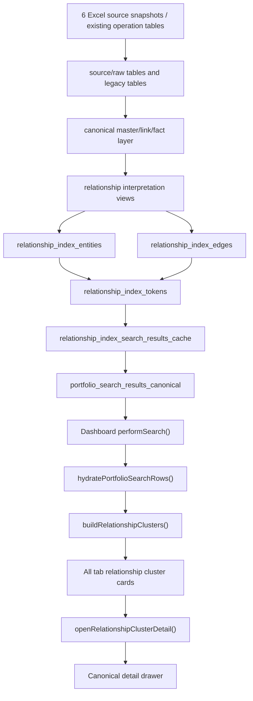
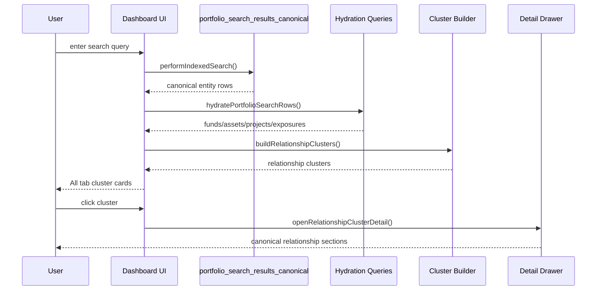

# RA Dashboard Relationship Cluster Architecture

작성일: 2026-06-09
대상: RA Dashboard Supabase DB 관계 계약층 및 검색/조회 UI
상태: 2026-06-09 relationship contract + relationship cluster UI 적용 기준

---

## 1. 한 줄 요약

RA Dashboard는 이제 `fund`, `asset`, `project`, `lender`, `beneficiary`를 각각 따로 검색해 나열하는 구조가 아니라, DB 안의 canonical 관계를 해석해 만든 **relationship index**를 먼저 조회하고, 화면에서는 사용자의 검색 의도에 맞는 **relationship cluster** 단위로 결과를 보여준다.

즉 현재 구조는 다음과 같다.

```text
원천 데이터 / 기존 운영 테이블
  -> canonical master/link/fact
  -> relationship interpretation views
  -> relationship index entities/edges/tokens
  -> portfolio_search_results_canonical
  -> dashboard hydration
  -> relationship cluster
  -> canonical detail drawer
```

이 구조의 핵심 목적은 회계 집계값을 즉시 확정하는 것이 아니라, 사용자가 `이오타서울`, `눈스퀘어`, `국민연금`, `홈플러스`, `1120`처럼 무엇을 검색하든 **기대하는 대상과 그 주변 관계를 중복 없이 같은 방식으로 찾고 들어갈 수 있게 하는 것**이다.

---

## 2. 설계 원칙

### 2.1 검색 결과는 개별 테이블 row가 아니라 관계 묶음이다

기존에는 검색어 하나가 다음처럼 흩어져 보였다.

```text
검색어: 눈스퀘어
  - fund 카드
  - asset 카드
  - project 카드
  - lender 카드
  - beneficiary 카드
```

현재는 `All` 탭에서 다음처럼 보인다.

```text
검색어: 눈스퀘어
  - Relationship Cluster: 눈스퀘어
      - 자산 1
      - 펀드 1
      - 프로젝트 1
```

`fund`, `asset`, `project`, `lender`, `beneficiary` 개별 탭은 유지한다. 다만 그것들은 원자료를 확인하기 위한 보조 필터이고, 사용자가 처음 보는 기본 결과는 `All` 탭의 cluster다.

### 2.2 같은 검색어는 같은 결과로 수렴해야 한다

검색 결과는 검색 경로에 따라 달라지면 안 된다.

예를 들어 `눈스퀘어`는 자산명으로 보든, 프로젝트명으로 보든, 펀드 연결로 보든 결국 하나의 cluster로 수렴해야 한다.

```text
눈스퀘어
  -> asset: ast_fe9e7fc006fb
  -> fund: 112006
  -> project: project_notion_...
  -> cluster: 눈스퀘어
```

### 2.3 DB는 관계 그래프, UI는 관계 해석 결과를 보여준다

DB는 여러 테이블로 분리된 관계형 구조를 유지한다.

화면은 그 테이블들을 그대로 노출하지 않고, 관계를 해석한 뒤 다음 형태로 보여준다.

```js
{
  cluster_id,
  cluster_type,
  title,
  subtitle,
  matched_entity,
  entities: {
    funds: [],
    assets: [],
    projects: [],
    lenders: [],
    beneficiaries: []
  },
  relation_paths: []
}
```

이 구조는 RAG와 유사하게 볼 수 있다. 단, 문서 벡터 검색이 아니라 **관계형 DB의 row와 edge를 해석한 retrieval layer**다.

### 2.4 관계가 증명되지 않은 row는 기본 cluster에 섞지 않는다

검색 token에 걸렸다는 이유만으로 모든 row를 cluster에 붙이지 않는다.

예를 들어 `눈스퀘어` 검색에서 다른 자산에 연결된 수익자/대주 row가 검색 token으로 잡힐 수 있다. 현재 cluster builder는 그런 row를 `All` cluster에 무조건 섞지 않고, asset/fund 관계로 증명되는 대상만 기본 cluster에 붙인다.

### 2.5 숫자 짧은 검색어는 fund/project code 중심이다

`1120` 같은 1-4자리 숫자 검색은 asset noise를 만들지 않는다.

현재 검증 결과:

```text
검색어: 1120
All cluster: 98
fund tab: 98
asset tab: 0
project tab: 2
```

---

## 3. 전체 구조도



---

## 4. DB Layer

### 4.1 원천/운영 테이블

현재 검색/관계 정비는 기존 운영 테이블을 삭제하지 않고, 그 위에 해석층을 얹는 방식이다.

주요 원천/운영 테이블:

| 구분 | 테이블/view | 역할 |
|---|---|---|
| Fund master | `funds`, `v_funds_enriched` | 펀드/비히클 기본 정보 |
| Asset master | `asset_master` | canonical asset 기준점 |
| Project master | `projects` | 프로젝트 및 parent/child project |
| Fund-asset link | `asset_fund_links` | fund와 asset의 강한 관계 |
| Project-asset link | `asset_project_links` | project/fund_as_project/pilot_code 등 혼합 관계의 원천 |
| Asset alias | `asset_aliases` | 자산명/별칭 검색 단서 |
| Lender exposure | `lender_exposures` | 대주 exposure fact |
| Beneficiary exposure | `beneficiary_exposures` | 수익자 exposure fact |
| AUM input | `asset_fund_aum_inputs` | 자산별 AUM 표시 우선 소스 |

### 4.2 Canonical asset name contract

비실물 자산과 실물 자산의 표시명을 분리한다.

주요 컬럼:

| 컬럼 | 의미 |
|---|---|
| `physical_asset_name` | 실물부동산 표시명 |
| `non_physical_asset_label` | 채권/증권/주식/펀드지분 등 비실물 자산 표시명 |
| `asset_name_cleanup_action` | 표시명 정비 상태 |
| `asset_name_cleanup_reason` | 정비 사유 |
| `canonical_name` | 기존 명칭 provenance. 즉시 삭제하지 않음 |

표시명 우선순위:

```text
physical_asset_name
  -> non_physical_asset_label
  -> asset_code
  -> asset_id
```

비실물 자산은 펀드명을 그대로 복사하지 않고 다음 형태로 표시한다.

```text
상품성격 · 약칭
예: 크레딧펀드 · 21호
예: 펀드지분 · 세컨더리1호
예: 전환사채/공모주/RCPS · 멀티인컴1호
```

관련 SQL:

```text
01. RA Portal/migrations/2026-06-09_asset_name_cleanup_contract.sql
```

### 4.3 Project link resolution

`asset_project_links.project_id`는 실제 project id만 의미하지 않는다. 기존 데이터에는 다음이 섞여 있다.

```text
project
fund_as_project
pilot_code
unresolved
```

이를 직접 FK로 강제하지 않고, 먼저 해석 view를 둔다.

주요 view:

| view | 역할 |
|---|---|
| `asset_project_link_resolution` | `asset_project_links`의 target을 `project`, `fund_as_project`, `pilot_code`, `unresolved`로 해석 |
| `project_asset_relationships` | 실제 project/pilot project -> asset 조회용 |
| `fund_as_project_asset_relationships` | fund id가 project처럼 쓰인 legacy 관계 조회용 |
| `iota_target_resolution` | IOTA 관련 target 해석 audit |

핵심 규칙:

```text
asset_project_links.project_id
  -> projects.project_id에 있으면 project
  -> funds.fund_id에 있으면 fund_as_project
  -> iota-% 형식이면 pilot_code
  -> 그 외 unresolved
```

대시보드는 `asset_project_links`를 직접 신뢰하지 않고, `asset_project_link_resolution` 및 그 파생 view를 사용한다.

관련 SQL:

```text
01. RA Portal/migrations/2026-06-08_relationship_contract_v1.sql
```

### 4.4 Exposure contract

대주/수익자 exposure는 사실상 party/fund fact다. `asset_id`는 direct key일 수도 있고, fund-asset 관계를 통해 파생될 수도 있다.

현재 규칙:

```text
direct exposure:
  lender_exposures.asset_id or beneficiary_exposures.asset_id exists

derived exposure:
  exposure.asset_id is null
  -> exposure.fund_id
  -> asset_fund_links.fund_id
  -> asset_id
```

주요 view:

| view | 역할 |
|---|---|
| `asset_exposure_edges` | exposure -> fund/asset edge를 direct/derived로 표준화 |
| `asset_exposure_summary` | lender와 beneficiary를 각각 선집계 후 asset 기준 join |

중요한 점:

`asset_exposure_summary`는 lender와 beneficiary를 바로 join하지 않는다. 각각 먼저 asset 기준으로 집계한 뒤 join한다. 이렇게 해야 lender N개 x beneficiary M개가 곱해져 금액이 부풀어 오르는 문제를 막을 수 있다.

### 4.5 Relationship index entities

`relationship_index_entities`는 검색/관계 그래프의 node 목록이다.

현재 entity type:

```text
fund
asset
project
lender
beneficiary
```

주요 컬럼:

| 컬럼 | 의미 |
|---|---|
| `entity_key` | `type:id` 형태의 내부 key |
| `entity_type` | fund/asset/project/lender/beneficiary |
| `entity_id` | canonical id |
| `display_title` | 사용자에게 보여줄 제목 |
| `display_subtitle` | 보조 표시 텍스트 |
| `source_table` | 원천 테이블 |
| `source_id` | 원천 id |
| `confidence` | 해석 신뢰도 |
| `status` | confirmed/review_required 등 |
| `metadata` | 보조 provenance |

예:

```text
fund:112006
asset:ast_fe9e7fc006fb
project:project_notion_...
lender:lender_<md5>
beneficiary:beneficiary_<md5>
```

### 4.6 Relationship index edges

`relationship_index_edges`는 graph edge 목록이다.

주요 edge type:

| edge_type | 의미 |
|---|---|
| `fund_asset` | fund -> asset |
| `asset_project` | project/fund_as_project -> asset |
| `project_parent_child` | parent project -> child project |
| `lender_fund` | lender party -> fund |
| `lender_asset` | lender party -> asset |
| `beneficiary_fund` | beneficiary party -> fund |
| `beneficiary_asset` | beneficiary party -> asset |

주요 컬럼:

| 컬럼 | 의미 |
|---|---|
| `edge_id` | edge 식별자 |
| `edge_type` | 관계 종류 |
| `source_entity_type` | source type |
| `source_entity_id` | source id |
| `target_entity_type` | target type |
| `target_entity_id` | target id |
| `relation_type` | 업무상 관계명 |
| `link_method` | direct/fallback/resolution 방식 |
| `source_table` | 원천 테이블/view |
| `confidence` | 관계 신뢰도 |
| `status` | confirmed/compatibility/review_required/unresolved |
| `include_in_search` | 검색에 포함할지 |
| `include_in_amount_rollup` | 금액 집계에 포함할지 |
| `evidence` | provenance JSON |

중요한 구분:

```text
include_in_search = true
  -> 검색/탐색에는 사용 가능

include_in_amount_rollup = false
  -> 금액 확정 집계에는 사용하지 않음
```

이 구분 덕분에, 검색은 넓게 이어주되 금액 집계는 보수적으로 유지할 수 있다.

### 4.7 Relationship tokens

`relationship_index_tokens`는 검색 가능한 token surface다.

token은 자기 자신의 표시명뿐 아니라 관계를 타고 만들어진 token도 포함한다.

예:

```text
fund name token
asset name token
asset alias token
project parent/child token
lender name token
beneficiary name token
fund -> asset token
project -> asset token
party -> fund/asset token
```

사용자는 fund name으로 검색해도 asset이 같이 나올 수 있고, asset alias로 검색해도 fund/project가 같이 나올 수 있다.

### 4.8 Canonical search result cache

`portfolio_search_results_canonical`은 대시보드의 1차 검색 surface다.

실제 backing은 materialized view:

```text
relationship_index_search_results_cache
```

그리고 public REST용 stable view:

```text
relationship_index_search_results
portfolio_search_results_canonical
```

주요 컬럼:

| 컬럼 | 의미 |
|---|---|
| `entity_type` | 결과 entity type |
| `entity_id` | 결과 entity id |
| `display_title` | canonical 표시명 |
| `display_subtitle` | 보조 설명 |
| `token_text` | 검색 가능한 token aggregate |
| `token_type` | `canonical_entity` |
| `related_asset_id` | 대표 related asset |
| `related_fund_id` | 대표 related fund |
| `related_project_id` | 대표 related project |
| `relation_type` | 대표 관계 |
| `source_table` | provenance |
| `rank_weight` | 정렬 weight |
| `token_row_count` | aggregate된 token row 수 |
| `relation_paths` | matching path/provenance JSON |

중요한 정책:

```text
portfolio_search_results_canonical은 entity_type + entity_id당 1 row다.
즉 DB surface 단계에서 이미 중복 카드의 원인을 줄인다.
```

---

## 5. Dashboard Search Logic

### 5.1 주요 파일

| 파일 | 역할 |
|---|---|
| `01. RA Portal/portfolio-analysis/js/search-results.js` | 검색, hydration, cluster 생성/렌더링 |
| `01. RA Portal/portfolio-analysis/js/detail-drawer.js` | fund/project/party canonical drawer |
| `01. RA Portal/portfolio-analysis/js/asset-canonical.js` | asset 검색/상세 |
| `01. RA Portal/portfolio-analysis/style.css` | cluster card/detail 스타일 |
| `01. RA Portal/portfolio-analysis/index.html` | JS cache-busting version |

### 5.2 검색 실행 흐름



### 5.3 `performSearch()`

`performSearch()`는 현재 검색의 entry point다.

기본 흐름:

```text
performSearch(query)
  -> getSearchTerms(query)
  -> performIndexedSearch(query, terms)
  -> hydratePortfolioSearchRows(indexRows)
  -> allResults 저장
  -> updateTabCounts()
  -> renderResults()
```

fallback:

```text
portfolio_search_results_canonical 실패
  -> portfolio_search_index fallback

relationship index 실패
  -> legacy direct table search fallback
```

단, 정상 상태에서는 `portfolio_search_results_canonical`을 우선 사용한다.

### 5.4 Hydration

`portfolio_search_results_canonical`은 검색용 compact surface다. 화면에 필요한 상세 데이터는 다시 hydrate한다.

hydration 대상:

| entity | hydrate source |
|---|---|
| fund | `v_funds_enriched` |
| asset | `asset_relationship_summary` |
| project | `projects` |
| lender | `lender_exposures` |
| beneficiary | `beneficiary_exposures` |

짧은 숫자 검색:

```text
if query matches /^\d{1,4}$/:
  entityTypes = fund, project
  includeRelatedAssets = false
```

이 규칙 때문에 `1120` 검색에서 asset noise가 나오지 않는다.

### 5.5 `All` 탭 렌더링

기존:

```text
All tab
  -> project cards
  -> fund cards
  -> asset cards
  -> lender cards
  -> beneficiary cards
```

현재:

```text
All tab
  -> relationship cluster cards only
```

개별 탭:

```text
Fund tab
Asset tab
Project tab
Beneficiary tab
Lender tab
```

이들은 유지된다. 그러나 기본 검색 UX는 `All`의 cluster다.

---

## 6. Relationship Cluster Logic

### 6.1 Cluster object

화면에서 사용하는 cluster 구조:

```js
{
  cluster_id: "asset:ast_fe9e7fc006fb",
  cluster_type: "asset",
  title: "눈스퀘어",
  subtitle: "자산 기반 관계 묶음",
  matched_entity: {
    type: "asset",
    id: "ast_fe9e7fc006fb"
  },
  entities: {
    funds: [],
    assets: [],
    projects: [],
    lenders: [],
    beneficiaries: []
  },
  relation_paths: []
}
```

### 6.2 Cluster type

| cluster_type | 사용 상황 | 예 |
|---|---|---|
| `asset` | 단일 자산 중심 검색 | `눈스퀘어` |
| `project` | parent/child project 중심 검색 | `이오타서울` |
| `party` | 특정 대주/수익자 기관 중심 검색 | `국민연금` |
| `topic` | 검색어가 여러 자산/펀드에 넓게 걸리는 경우 | `홈플러스` |
| `fund` | fund/code 중심 검색 | `1120` |

### 6.3 Asset cluster

자산 중심 cluster는 다음을 모은다.

```text
matched asset
  -> asset_fund relationships
  -> asset_project relationships
  -> fund-linked lender/beneficiary
  -> same-title project
```

예:

```text
눈스퀘어
  자산 1
  펀드 1
  프로젝트 1
```

### 6.4 Project cluster

Project cluster는 parent/child scope를 확장한다.

```text
parent project
  -> child projects
  -> project_asset_relationships
  -> asset
  -> fund_asset_relationships
  -> funds
```

예:

```text
이오타서울
  project: iota-seoul
  child projects: iota-421f, iota-427, iota-816
  assets: ast_aefd81e93778, ast_cd9937cc8678
  funds: 112057, 112472, 112473, 112614, 112706, 112707, 120016, 120113
```

현재 `이오타서울` 검색 결과:

```text
cluster 1
자산 2
펀드 8
프로젝트 4
```

주의:

DB canonical surface에는 IOTA 관련 project가 6개 잡힌다. 그러나 relationship cluster는 실제 asset/fund 관계 payload가 있는 project scope로 줄여 보여준다. 그래서 `All` cluster에는 프로젝트 4개가 표시된다. 관계 없는 project-only 검색 잡음은 `All` cluster에 섞지 않는다.

### 6.5 Party cluster

Party cluster는 대주/수익자명 검색에 사용한다.

```text
party name
  -> exposure rows
  -> fund_id
  -> asset_fund_links
  -> asset
  -> project
```

예:

```text
국민연금
  -> 국민연금공단 cluster
  -> 자산 10
  -> 펀드 10
  -> 프로젝트 2
  -> 수익자 9
```

### 6.6 Topic cluster

Topic cluster는 검색어가 여러 asset/fund/project/party에 넓게 걸릴 때 사용한다.

예:

```text
홈플러스
  -> 홈플러스 topic cluster
  -> 자산 27
  -> 펀드 19
  -> 프로젝트 6
  -> 대주 9
  -> 수익자 6
```

이 규칙이 없으면 `홈플러스` 검색에서 `GIB홈플러스` 같은 party명 하나가 먼저 잡혀 전체 자산 맥락을 가릴 수 있다. 따라서 matching asset이 2개 이상이면 party cluster보다 topic cluster를 우선한다.

### 6.7 Numeric/fund cluster

짧은 숫자 검색은 fund/code 중심이다.

예:

```text
1120
  -> fund/code clusters
  -> asset 0
```

이 정책은 숫자 검색이 수많은 asset id, pnu, 주소 token으로 번지는 것을 막는다.

---

## 7. Detail Drawer Logic

### 7.1 Cluster detail

cluster card를 클릭하면 바로 fund/asset/project 중 하나로 점프하지 않는다.

먼저 `openRelationshipClusterDetail()`이 다음 섹션을 보여준다.

```text
Relationship Cluster
  - 연결 자산
  - 연결 펀드/비히클
  - 연결 프로젝트
  - 연결 대주
  - 연결 수익자
```

그 안에서 개별 row를 클릭하면 기존 canonical drawer로 들어간다.

### 7.2 Asset detail

Asset row 클릭:

```text
AssetCanonical.renderCanonicalAssetDetail(asset_id, title, { inlineOnly: true })
```

조회 경로:

```text
asset_master
asset_building_ledger
fund_asset_relationships
project_asset_relationships
lender_exposures
beneficiary_exposures
```

### 7.3 Fund detail

Fund row 클릭:

```text
openFundRelationshipDrawer(fund_id, title, { inline: true })
```

조회 경로:

```text
v_funds_enriched
fund_asset_relationships
lender_exposures
beneficiary_exposures
```

canonical 우선:

```text
fund_id -> fund_asset_relationships -> asset_master
```

fallback:

```text
primary_asset_id / primary_asset_ids
```

### 7.4 Project detail

Project row 클릭:

```text
openProjectRelationshipDrawer(project_id, title, { inline: true, relatedAssetIds })
```

조회 경로:

```text
project
  -> child projects
  -> project_asset_relationships
  -> asset
  -> fund_asset_relationships
  -> funds
```

중요:

`project_id = fund_id` fallback은 `fund_as_project` 성격일 때만 compatibility path로 본다. 일반 project drawer는 parent/child project -> asset -> fund 경로를 우선한다.

### 7.5 Party detail

Party row 클릭:

```text
openInstitutionRelationshipDrawer(type, title, rows, { inline: true })
```

조회 경로:

```text
lender/beneficiary exposure
  -> fund
  -> asset_fund_relationships
  -> asset
```

---

## 8. Display Policy

### 8.1 Fund title

```text
[short_name] fund_name
```

예:

```text
[7호] 이지스일반사모부동산투자신탁7호
```

### 8.2 Asset title

```text
physical_asset_name
  -> non_physical_asset_label
  -> asset_code
  -> asset_id
```

### 8.3 Project title

```text
project_name
  -> project_mission_name
  -> project_id
```

### 8.4 Party title

```text
lender_clean / lender_raw
beneficiary_clean / beneficiary_raw
```

### 8.5 Cluster title

| cluster type | title |
|---|---|
| asset | asset display title |
| project | root project display title |
| party | party display title |
| topic | raw search query |
| fund | fund display title |

---

## 9. Current Search Behavior

최종 headless Edge 검증 기준이다.

| 검색어 | All cluster | 첫 cluster title | chips | 개별 카드 중복 |
|---|---:|---|---|---:|
| `이오타서울` | 1 | `이오타서울 (IOTA Seoul)` | 자산 2, 펀드 8, 프로젝트 4 | 0 |
| `눈스퀘어` | 1 | `눈스퀘어` | 자산 1, 펀드 1, 프로젝트 1 | 0 |
| `국민연금` | 1 | `국민연금공단` | 자산 10, 펀드 10, 프로젝트 2, 수익자 9 | 0 |
| `홈플러스` | 1 | `홈플러스` | 자산 27, 펀드 19, 프로젝트 6, 대주 9, 수익자 6 | 0 |
| `1120` | 98 | fund/code list | fund 중심, asset 0 | 0 |

DB canonical search surface audit:

| 검색어 | total | fund | asset | project | lender | beneficiary |
|---|---:|---:|---:|---:|---:|---:|
| 이오타서울 | 16 | 8 | 2 | 6 | 0 | 0 |
| 눈스퀘어 | 8 | 1 | 1 | 1 | 2 | 3 |
| 국민연금 | 23 | 8 | 10 | 4 | 0 | 1 |
| 홈플러스 | 50 | 10 | 29 | 0 | 0 | 11 |
| 1120 | 50 | 50 | 0 | 0 | 0 | 0 |

설명:

DB canonical search surface는 검색 가능한 entity 후보를 넓게 반환한다. Dashboard `All` 탭은 이 후보들을 다시 relationship cluster로 묶어 사용자에게 의미 있는 단위로 줄여 보여준다.

예를 들어 `홈플러스`는 DB search surface에서 asset 29, fund 10, beneficiary 11 등을 반환하지만, 화면에서는 `홈플러스` topic cluster 1개로 묶는다.

---

## 10. Current Live Counts

2026-06-09 audit 기준:

| surface | count |
|---|---:|
| `portfolio_search_results_canonical` | 3,560 |
| `portfolio_search_index` | 41,488 |
| `relationship_index_entities` | 3,560 |
| `relationship_index_edges` | 5,730 |
| `relationship_index_search_results` | 3,560 |
| `asset_exposure_edges` | 1,852 |
| `relationship_index_audit` | 1,413 |
| `dashboard_relationship_contract_audit` | 0 |
| `relationship_contract_audit_v1` | 2,714 |
| `funds` | 1,112 |
| `asset_master` | 1,302 |
| `asset_fund_links` | 1,217 |
| `asset_project_links` | 879 |
| `projects` | 425 |
| `lender_exposures` | 670 |
| `beneficiary_exposures` | 1,118 |

Audit highlights:

| audit | count | 의미 |
|---|---:|---|
| `dashboard_relationship_contract_audit` | 0 | 이전 contract 기준 critical issue 없음 |
| `asset_project_link_unresolved_target` | 0 | project link 해석 불가 target 없음 |
| `fund_primary_asset_without_link` | 0 | primary asset만 있고 link 없는 fund 없음 |
| `project_primary_asset_without_link` | 0 | primary asset만 있고 link 없는 project 없음 |
| `aum_allocation_review_required` | 1,217 | AUM allocation 검토 필요. 오류가 아니라 warning |
| `asset_exposure_edges.multi_asset_review_required` | 98 | multi-asset exposure 배분 검토 필요 |
| `dashboard_search_result_contract_audit.display_title_variants` | 8 | 동일 entity 표시명 variant 검토 대상 |
| `dashboard_search_result_contract_audit.blank_display_title` | 0 | blank 표시명 없음 |

---

## 11. SQL Apply/Refresh Order

관계 contract를 새로 적용하거나 재적용할 때 순서는 중요하다.

```text
1. 2026-06-09_asset_name_cleanup_contract.sql
2. 2026-06-08_portfolio_search_index.sql
3. 2026-06-08_relationship_contract_v1.sql
4. 2026-06-09_relationship_index_v1.sql
5. 2026-06-09_relationship_index_search_cache.sql
6. 2026-06-09_asset_nonphysical_label_suffix_hotfix.sql
7. 2026-06-09_relationship_audit_cache.sql
```

search cache refresh가 필요한 경우:

```sql
refresh materialized view public.relationship_index_search_results_cache;
refresh materialized view public.relationship_index_audit_cache;
```

주의:

`relationship_index_search_results_cache`는 dashboard primary search surface의 backing cache다. canonical 관계 데이터가 바뀌면 refresh해야 검색 결과가 최신이 된다.

---

## 12. Frontend Implementation Map

### 12.1 Search/hydration

| 함수 | 위치 | 역할 |
|---|---|---|
| `performIndexedSearch()` | `search-results.js` | `portfolio_search_results_canonical` 우선 조회 |
| `performIndexedSearchOn()` | `search-results.js` | Supabase REST query 실행 |
| `hydratePortfolioSearchRows()` | `search-results.js` | compact search row를 화면용 row로 hydrate |
| `performLegacySearch()` | `search-results.js` | relationship index 실패 시 fallback |

### 12.2 Cluster generation

| 함수 | 역할 |
|---|---|
| `buildRelationshipClusters()` | 검색 결과 전체를 cluster list로 변환 |
| `buildBroadTopicCluster()` | 넓게 걸리는 검색어를 topic cluster로 묶음 |
| `buildPartyClusters()` | lender/beneficiary 중심 cluster 생성 |
| `buildProjectClusters()` | parent/child project cluster 생성 |
| `buildAssetClusters()` | asset 중심 cluster 생성 |
| `buildFundClusters()` | fund/code 중심 cluster 생성 |

### 12.3 Rendering

| 함수 | 역할 |
|---|---|
| `updateTabCounts()` | `All` count는 cluster count로 표시 |
| `renderResults()` | `All` 탭은 cluster card만 렌더 |
| `renderRelationshipClusterCard()` | cluster card UI |
| `openRelationshipClusterDetail()` | cluster 상세 패널 |
| `clusterDetailSectionHtml()` | cluster 상세의 entity section |

### 12.4 Detail routing

| row type | route |
|---|---|
| asset | `AssetCanonical.renderCanonicalAssetDetail()` |
| fund | `openFundRelationshipDrawer()` |
| project | `openProjectRelationshipDrawer()` |
| lender | `openInstitutionRelationshipDrawer('lender')` |
| beneficiary | `openInstitutionRelationshipDrawer('ben')` |

---

## 13. UX Behavior

### 13.1 All tab

`All` 탭은 관계 cluster만 보여준다.

cluster card 구성:

```text
RELATION
title
subtitle
chips: 자산 n / 펀드 n / 프로젝트 n / 대주 n / 수익자 n
preview rows
```

### 13.2 Entity tabs

개별 탭은 여전히 타입별 row 확인에 사용한다.

```text
Fund tab: hydrated fund rows
Asset tab: canonical asset cards
Project tab: project rows
Beneficiary tab: beneficiary exposure rows
Lender tab: lender exposure rows
```

### 13.3 Cluster detail

cluster click:

```text
cluster card
  -> relationship cluster detail
  -> entity row
  -> canonical detail drawer
```

이 방식은 사용자가 바로 특정 entity로 튀어 들어가는 대신, 먼저 관계 묶음의 전체 맥락을 본 뒤 원하는 항목을 선택하게 한다.

---

## 14. Why This Is Better Than The Previous Model

### 14.1 이전 문제

이전 구조에서는 대시보드가 여러 테이블을 각각 직접 검색했다.

```text
v_funds_enriched
projects
fund_assets
lender_exposures
beneficiary_exposures
asset_relationship_summary
```

문제:

```text
데이터는 있는데 관계 경로로 안 보임
같은 대상이 여러 카드로 중복 노출
project_id와 fund_id fallback이 섞임
asset name이 fund name처럼 보임
검색어가 어느 테이블에 걸렸는지에 따라 결과 경험이 달라짐
```

### 14.2 현재 개선

현재 구조:

```text
canonical relationship index first
dashboard cluster second
drawer follows canonical path
```

효과:

```text
검색 결과 중복 감소
검색 의도별 출력 통일
fund/asset/project 다대다 관계를 한 카드 안에서 표현
parent project -> child project -> asset -> fund 경로 지원
exposure direct/derived 구분
legacy fallback은 낮은 우선순위로 격리
```

---

## 15. Maintenance Guide

### 15.1 새 원천 데이터가 들어왔을 때

권장 흐름:

```text
1. source/raw snapshot 적재
2. normalized staging 생성
3. canonical master/link/fact 반영
4. relationship contract audit 확인
5. relationship search cache refresh
6. 대표 검색어 regression
```

### 15.2 새 관계를 추가할 때

관계는 가능하면 `relationship_index_edges`에 다음 정보가 남아야 한다.

```text
edge_type
source_entity_type
source_entity_id
target_entity_type
target_entity_id
relation_type
link_method
confidence
status
include_in_search
include_in_amount_rollup
evidence
```

### 15.3 새 검색 유형을 추가할 때

추가할 위치:

```text
DB:
  relationship_index_entities
  relationship_index_edges
  relationship_index_tokens

Frontend:
  hydratePortfolioSearchRows()
  buildRelationshipClusters()
  cluster card/detail renderer
```

### 15.4 Audit를 봐야 하는 경우

다음 파일/스크립트를 사용한다.

```text
01. RA Portal/tools/data-reconciliation/audit_dashboard_relationship_contract.py
01. RA Portal/output/dashboard_relationship_contract/query_summary.csv
01. RA Portal/output/dashboard_relationship_contract/query_detail.csv
01. RA Portal/output/dashboard_relationship_contract/surface_counts.json
```

대표 실행:

```powershell
$env:SUPABASE_URL='https://qvegpozwrcmspdvjokiz.supabase.co'
$env:SUPABASE_KEY='...'
& 'C:\Users\10137\.cache\codex-runtimes\codex-primary-runtime\dependencies\python\python.exe' `
  01. RA Portal/tools/data-reconciliation/audit_dashboard_relationship_contract.py `
  --query "이오타서울" `
  --query "눈스퀘어" `
  --query "국민연금" `
  --query "홈플러스" `
  --query "1120" `
  --limit 50
```

---

## 16. Known Warnings / Not Bugs

### 16.1 AUM allocation warning

`aum_allocation_review_required`가 많게 나오는 것은 현재 오류로 보지 않는다.

이유:

```text
멀티자산 펀드의 자산별 AUM을 임의 배분하지 않는 정책이기 때문
```

대시보드에서는 asset-level 확정 AUM처럼 보이지 않게 하고, 검토 필요 상태로 표시해야 한다.

### 16.2 Exposure multi-asset review

`multi_asset_review_required`는 fund_id를 통해 asset이 여러 개 파생되는 경우다.

검색/탐색에는 사용할 수 있지만, 금액 rollup에는 보수적으로 제외한다.

### 16.3 Entity tab count와 All cluster count는 다르다

예:

```text
홈플러스
  All: 1
  asset tab: 29
  fund tab: 19
  lender tab: 21
```

이 차이는 의도된 것이다.

`All`은 relationship cluster count이고, 개별 탭은 raw/hydrated entity count다.

### 16.4 DB canonical 후보 수와 UI cluster entity 수는 다를 수 있다

예:

```text
이오타서울
  DB project candidates: 6
  UI cluster projects: 4
```

UI cluster는 실제 relationship payload가 있는 범위로 줄여 보여준다. 관계 없는 project-only 후보는 개별 project tab에서 확인 가능하지만, `All` cluster의 주 결과에는 섞지 않는다.

---

## 17. Verification Evidence

### 17.1 Static checks

다음 파일은 syntax check를 통과했다.

```text
node --check 01. RA Portal/portfolio-analysis/js/search-results.js
node --check 01. RA Portal/portfolio-analysis/js/detail-drawer.js
node --check 01. RA Portal/portfolio-analysis/js/asset-canonical.js
```

### 17.2 Browser checks

Headless Edge + local server + Supabase/CDN network access 기준:

| query | currentSearchQuery | clusterCount | oldCardCountInAll | expected |
|---|---|---:|---:|---|
| 이오타서울 | 이오타서울 | 1 | 0 | OK |
| 눈스퀘어 | 눈스퀘어 | 1 | 0 | OK |
| 국민연금 | 국민연금 | 1 | 0 | OK |
| 홈플러스 | 홈플러스 | 1 | 0 | OK |
| 1120 | 1120 | 98 | 0 | OK |

### 17.3 Detail route checks

`이오타서울` cluster detail:

```text
cluster header: 이오타서울 (IOTA Seoul)
sections:
  - 연결 자산 (2)
  - 연결 펀드/비히클 (8)
  - 연결 프로젝트 (4)
detail rows: 14
```

Entity row click:

| row | result |
|---|---|
| asset row | `CANONICAL ASSET` detail 정상 |
| fund row | `FUND SELECTED` drawer 정상 |
| project row | `PROJECT SELECTED` drawer 정상 |

### 17.4 Mobile check

Viewport:

```text
395 x 853
```

`IOTA` cluster:

```text
clusterCount: 1
oldCardCountInAll: 0
overflowCount: 0
```

---

## 18. Conceptual Summary

현재 RA Dashboard의 핵심은 다음 문장으로 설명할 수 있다.

> DB의 각 테이블을 직접 검색해서 보여주는 것이 아니라, DB 전체를 관계 그래프로 해석한 뒤, 그 그래프에서 검색된 entity 후보들을 사용자 의도에 맞는 relationship cluster로 다시 묶어 보여준다.

조금 더 제품 관점으로 쓰면:

> RA Dashboard는 펀드, 자산, 프로젝트, 대주, 수익자를 따로 찾는 검색기가 아니라, RA 포트폴리오의 관계를 따라 대상을 발견하고 맥락을 탐색하는 relationship-aware discovery interface다.

그리고 운영 관점의 핵심 계약은 다음과 같다.

```text
canonical truth:
  asset_master
  asset_fund_links
  asset_project_link_resolution
  projects.parent_project_id
  asset_exposure_edges

search truth:
  relationship_index_entities
  relationship_index_edges
  relationship_index_tokens
  portfolio_search_results_canonical

UI truth:
  relationship cluster
  canonical detail drawer
```

---

## 19. Glossary

| 용어 | 의미 |
|---|---|
| canonical asset | `asset_master.asset_id`를 기준으로 정리된 자산 |
| relationship index | entity/edge/token/search result로 구성된 관계 해석층 |
| relationship cluster | 화면에서 보여주는 검색 결과 묶음 |
| hydration | compact search row를 실제 화면 표시용 row로 다시 조회하는 과정 |
| party | lender 또는 beneficiary 같은 기관/참여자 |
| topic cluster | 검색어가 여러 asset/fund/party에 넓게 걸릴 때 만드는 검색어 중심 묶음 |
| direct exposure | exposure row에 asset_id가 직접 있는 경우 |
| derived exposure | exposure row에는 asset_id가 없고 fund_id -> asset_fund_links로 파생된 경우 |
| amount rollup | 금액 집계에 포함하는지 여부 |
| compatibility path | 과거 데이터 호환을 위해 낮은 우선순위로 유지하는 fallback 경로 |
