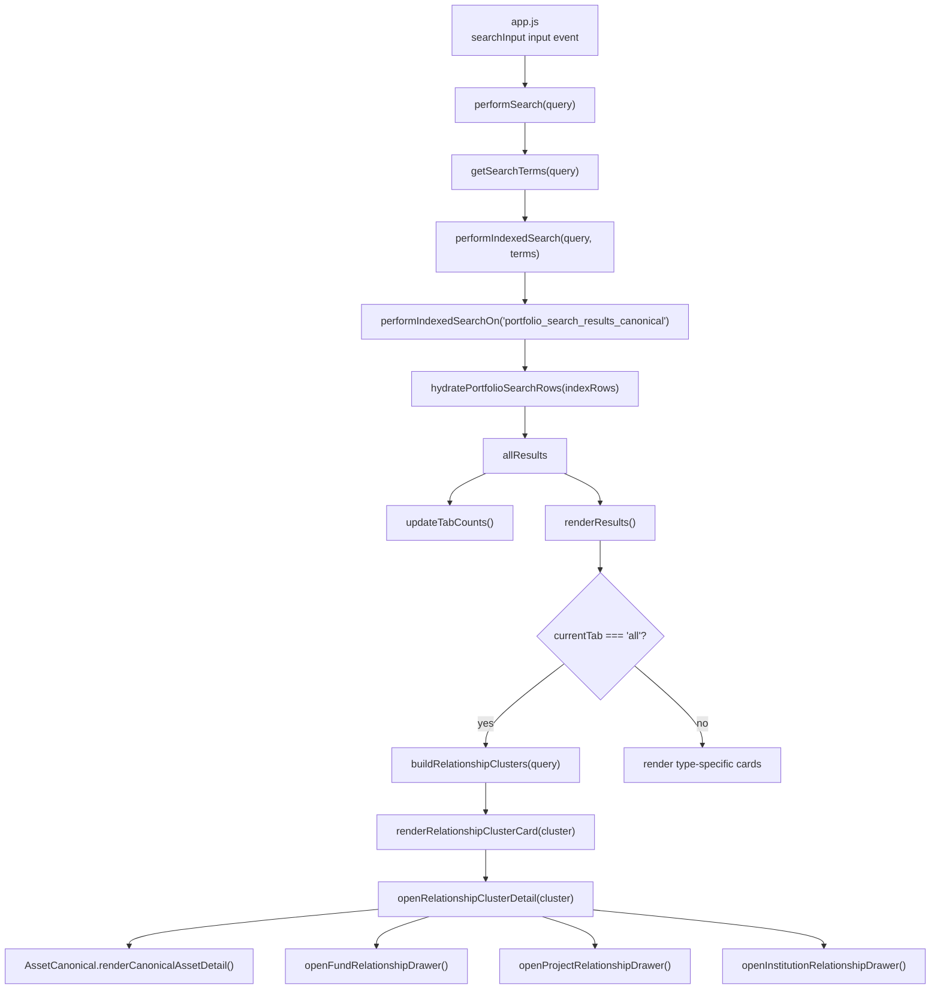

# RA Dashboard Search Logic Code Digest

작성일: 2026-06-10
범위: 대시보드의 검색 입력, Supabase 조회, hydration, 관계 클러스터 구성, 결과 렌더링, 상세 이동 로직
대상 코드: `01. RA Portal/portfolio-analysis`

---

## 1. 검색 로직 한 줄 요약

현재 대시보드 검색은 사용자가 입력한 검색어로 각 테이블을 직접 뒤지는 구조가 아니라, 먼저 `portfolio_search_results_canonical`이라는 관계 인덱스 surface를 조회하고, 그 결과의 `entity_type/entity_id/related_*_id`를 기준으로 실제 표시 데이터를 보강한 뒤, `relationship cluster`로 묶어서 출력한다.

```text
input event
  -> performSearch(query)
  -> portfolio_search_results_canonical 조회
  -> hydratePortfolioSearchRows()
  -> assetRowsForSearchContext()
  -> buildRelationshipClusters()
  -> renderRelationshipClusterCard()
  -> openRelationshipClusterDetail()
  -> asset/fund/project/party detail drawer
```

---

## 2. 주요 파일

| 파일 | 핵심 함수 | 역할 |
|---|---|---|
| `01. RA Portal/portfolio-analysis/app.js` | `initApp()` | 검색 input event, tab click, 조회/분석 view toggle |
| `01. RA Portal/portfolio-analysis/js/core.js` | `getSearchTerms()`, `isShortNumericSearch()`, `buildUniversalFilter()` | 검색어 분해, 짧은 숫자 검색 판별, Supabase `.or()` filter 생성 |
| `01. RA Portal/portfolio-analysis/js/core.js` | `ensureAllDataLoaded()` | 종합 분석용 bulk load. 검색 주 경로는 아님 |
| `01. RA Portal/portfolio-analysis/js/search-results.js` | `performSearch()` | 검색 entry point |
| `01. RA Portal/portfolio-analysis/js/search-results.js` | `performIndexedSearch()` | canonical search surface 선택 |
| `01. RA Portal/portfolio-analysis/js/search-results.js` | `hydratePortfolioSearchRows()` | index row를 실제 fund/asset/project/exposure row로 보강 |
| `01. RA Portal/portfolio-analysis/js/search-results.js` | `assetRowsForSearchContext()` | 자산 표시 단위 병합 및 같은 위치 힌트 흡수 |
| `01. RA Portal/portfolio-analysis/js/search-results.js` | `buildRelationshipClusters()` | 전체 탭의 관계 묶음 생성 |
| `01. RA Portal/portfolio-analysis/js/search-results.js` | `renderResults()` | 탭별 결과 렌더링 |
| `01. RA Portal/portfolio-analysis/js/search-results.js` | `openRelationshipClusterDetail()` | cluster 클릭 후 상세 패널 구성 |
| `01. RA Portal/portfolio-analysis/js/asset-canonical.js` | `renderCanonicalAssetCards()`, `renderCanonicalAssetDetail()` | 자산 탭 카드 및 자산 상세 |
| `01. RA Portal/portfolio-analysis/js/detail-drawer.js` | `openFundRelationshipDrawer()`, `openProjectRelationshipDrawer()`, `openInstitutionRelationshipDrawer()` | 펀드/프로젝트/기관 상세 관계 조회 |

---

## 3. 전체 호출 흐름



---

## 4. 검색 입력 Event

파일: `01. RA Portal/portfolio-analysis/app.js`

```js
function initApp() {
  var searchInput = document.getElementById('searchInput');

  if (searchInput) {
    searchInput.addEventListener('input', function (event) {
      clearTimeout(debounceTimer);
      debounceTimer = setTimeout(function () {
        if (typeof performSearch === 'function') {
          performSearch(event.target.value);
        }
      }, 400);
    });
  }
}
```

핵심:

```text
사용자 입력
  -> 400ms debounce
  -> performSearch(query)
```

검색어가 바뀔 때마다 바로 DB를 때리지 않고 400ms 지연한다.

---

## 5. 검색 Entry Point

파일: `01. RA Portal/portfolio-analysis/js/search-results.js`

```js
function performSearch(query) {
  window.currentSearchQuery = query || '';
  window.searchContractMode = 'canonical';
  latestSearchRequestId += 1;
  window.latestSearchRequestId = latestSearchRequestId;
  var requestId = latestSearchRequestId;

  if (!query) {
    resultsContainer.innerHTML = '<div class="no-results">조회를 시작하세요.</div>';
    updateTabCounts();
    return Promise.resolve();
  }

  var terms = getSearchTerms(query);
  return performIndexedSearch(query, terms).then(function (hydrated) {
    if (requestId !== latestSearchRequestId) return;
    allResults = hydrated;
    window.allResults = allResults;
    updateTabCounts();
    renderResults();
  }).catch(function (error) {
    if (requestId !== latestSearchRequestId) return;
    window.searchContractMode = 'legacy_fallback';
    return performLegacySearch(query, requestId);
  });
}
```

핵심:

| 코드 | 의미 |
|---|---|
| `window.currentSearchQuery` | 현재 검색어 전역 저장 |
| `window.searchContractMode = 'canonical'` | canonical search가 기본 경로 |
| `latestSearchRequestId` | 빠른 연속 입력 시 늦게 도착한 이전 응답 폐기 |
| `performIndexedSearch()` | relationship index 기반 검색 |
| `performLegacySearch()` | canonical view 장애 시 낮은 우선순위 fallback |

---

## 6. Canonical Search Surface 선택

파일: `01. RA Portal/portfolio-analysis/js/search-results.js`

```js
function performIndexedSearch(query, terms) {
  var options = isShortNumericSearch(query)
    ? { entityTypes: ['fund', 'project'], includeRelatedAssets: false, limit: 200 }
    : {};

  return performIndexedSearchOn('portfolio_search_results_canonical', terms, options).catch(function (canonicalError) {
    window.searchContractMode = 'raw_token_fallback';
    return performIndexedSearchOn('portfolio_search_index', terms, options);
  });
}
```

핵심:

```text
기본:
  portfolio_search_results_canonical

canonical view 실패:
  portfolio_search_index fallback

1-4자리 숫자 검색:
  fund/project만 검색
  related asset 확장 끔
```

짧은 숫자 검색 예:

```text
1120
  -> fund/project code 중심
  -> asset noise 방지
```

---

## 7. Supabase Index Query

파일: `01. RA Portal/portfolio-analysis/js/search-results.js`

```js
function performIndexedSearchOn(surface, terms, options) {
  options = options || {};
  options.terms = terms;
  var query = _supabase
    .from(surface)
    .select('*')
    .or(buildUniversalFilter(['token_text'], terms))
    .order('rank_weight', { ascending: false })
    .limit(options.limit || 300);

  if (options.entityTypes && options.entityTypes.length) {
    query = query.in('entity_type', options.entityTypes);
  }

  return query.then(function (indexRes) {
    if (indexRes.error) throw indexRes.error;
    return hydratePortfolioSearchRows(indexRes.data || [], options);
  });
}
```

실제 1차 검색 대상:

```text
portfolio_search_results_canonical.token_text
```

검색 결과는 아직 화면에 직접 뿌리지 않는다. 이 결과는 다음 hydration의 ID seed다.

---

## 8. Hydration

파일: `01. RA Portal/portfolio-analysis/js/search-results.js`

`portfolio_search_results_canonical`에서 나온 row는 다음 필드를 가진다.

```text
entity_type
entity_id
display_title
token_text
related_asset_id
related_fund_id
related_project_id
relation_type
source_table
rank_weight
```

이 row에서 관련 ID를 모아 실제 표시용 테이블을 다시 읽는다.

```js
var fundIds = uniqueValues(indexRowsForType(indexRows, 'fund').map(function (row) { return row.entity_id; })
  .concat(relatedIdRows.map(function (row) { return row.related_fund_id; })));

var assetIds = uniqueValues(assetIdSources);

var projectIds = uniqueValues(indexRowsForType(indexRows, 'project').map(function (row) { return row.entity_id; })
  .concat(relatedIdRows.map(function (row) { return row.related_project_id; })));
```

Hydration read:

```js
var fundReq = _supabase.from('v_funds_enriched').select('*').in('fund_id', fundIds).limit(500);
var assetReq = _supabase.from('asset_relationship_summary').select('*').in('asset_id', assetIds).limit(500);
var assetMasterReq = _supabase.from('asset_master').select('*').in('asset_id', assetIds).limit(500);
var projectReq = _supabase.from('projects').select('*').in('project_id', projectIds).limit(500);
var lenderReq = _supabase.from('lender_exposures').select('*, funds(*)').in('id', lenderIds).limit(500);
var beneficiaryReq = _supabase.from('beneficiary_exposures').select('*, funds(*)').in('id', beneficiaryIds).limit(500);
```

반환 shape:

```js
return {
  lenders: dedupeEntities(...),
  beneficiaries: dedupeEntities(...),
  funds: dedupeEntities(funds, 'fund'),
  assets: [],
  projects: dedupeEntities(...),
  assetGroups: mergeAssetDisplayRows(...),
  _indexRows: indexRows
};
```

중요:

```text
allResults.assets는 거의 비워두고,
자산은 assetGroups를 사용한다.

assetGroups는 asset_relationship_summary + asset_master를 병합한 뒤
표시 자산 단위로 dedupe한 결과다.
```

---

## 9. 자산 표시 단위 병합

파일: `01. RA Portal/portfolio-analysis/js/search-results.js`

검색 결과가 지저분해지는 가장 큰 원인은 같은 실물 자산이 여러 row로 잡히는 것이다. 그래서 asset은 별도 규칙으로 병합한다.

```js
function cleanAssetDisplayTitle(title) {
  return String(title || '')
    .replace(/\s*\((투자|investment)\)\s*$/i, '')
    .replace(/\s*\[(투자|investment)\]\s*$/i, '')
    .trim();
}
```

```js
function assetRowsForSearchContext(rows, terms) {
  var merged = mergeAssetDisplayRows(rows || []);
  var matching = merged.filter(function (asset) {
    return titleMatchesQuery('asset', asset, terms);
  });
  return matching.length ? absorbSameLocationAssets(matching, merged, terms) : merged;
}
```

역할:

| 함수 | 역할 |
|---|---|
| `cleanAssetDisplayTitle()` | `홈플러스죽도점 (투자)` -> `홈플러스죽도점` |
| `assetDisplayGroupKey()` | 표시명 기반 asset group key 생성 |
| `mergeAssetDisplayRows()` | 같은 표시 자산을 하나로 접음 |
| `assetLocationKey()` | PNU/address 기반 위치 key 생성 |
| `absorbSameLocationAssets()` | 직접 검색 대상이 아닌 같은 위치 asset을 관계 힌트로 흡수 |
| `assetRowsForSearchContext()` | 현재 검색어 기준으로 실제 출력할 asset root 결정 |

예:

```text
검색어: 분당

출력 root:
  롯데백화점분당점
  분당야탑물류센터
  분당Hostway IDC

별도 root로 내보내지 않는 관계 힌트:
  북미DC포트폴리오
```

---

## 10. 관계 Map 구성

파일: `01. RA Portal/portfolio-analysis/js/search-results.js`

Hydration이 끝나면 `_indexRows`와 hydrated row를 이용해 양방향 관계 map을 만든다.

```js
function buildRelationshipMaps(rows) {
  var maps = {
    assetFunds: {}, fundAssets: {},
    assetProjects: {}, projectAssets: {},
    fundProjects: {}, projectFunds: {},
    lenderFunds: {}, fundLenders: {},
    lenderAssets: {}, assetLenders: {},
    benFunds: {}, fundBens: {},
    benAssets: {}, assetBens: {}
  };

  (allResults._indexRows || []).forEach(function (row) {
    var assetIds = uniqueValues([(entityType === 'asset' ? entityId : null), row.related_asset_id]);
    var fundIds = uniqueValues([(entityType === 'fund' ? entityId : null), row.related_fund_id]);
    var projectIds = uniqueValues([(entityType === 'project' ? entityId : null), row.related_project_id]);

    assetIds.forEach(function (assetId) {
      fundIds.forEach(function (fundId) { appendTwoWay(maps.assetFunds, maps.fundAssets, assetId, fundId); });
      projectIds.forEach(function (projectId) { appendTwoWay(maps.assetProjects, maps.projectAssets, assetId, projectId); });
    });
  });

  return maps;
}
```

결과적으로 cluster builder는 DB를 다시 읽지 않고, 이미 읽어온 row와 map만으로 관계를 구성한다.

---

## 11. Relationship Cluster 생성

파일: `01. RA Portal/portfolio-analysis/js/search-results.js`

```js
function buildRelationshipClusters(query) {
  var rows = relationshipEntityRows();
  var terms = getSearchTerms(query || '');
  var lookups = relationshipEntityLookups(rows);
  var maps = buildRelationshipMaps(rows);
  var clusters = [];

  if (isShortNumericSearch(query)) {
    clusters = buildFundClusters(query, rows, maps, lookups, terms, null)
      .concat(buildProjectClusters(query, rows, maps, lookups, terms));
    return sortClusters(clusters);
  }

  var partyClusters = buildPartyClusters(query, rows, maps, lookups, terms);
  var assetClusters = buildAssetClusters(query, rows, maps, lookups, terms);

  if (partyClusters.length) {
    clusters = partyClusters;
  } else if (assetClusters.length) {
    clusters = assetClusters;
  } else if (hasProjectDominance(query, rows, lookups, terms)) {
    clusters = buildProjectClusters(query, rows, maps, lookups, terms);
  } else {
    clusters = buildAssetClusters(...)
      .concat(buildProjectClusters(...))
      .concat(buildFundClusters(...));
  }

  return sortClusters(clusters);
}
```

분기 의미:

| 검색 성격 | root cluster |
|---|---|
| `국민연금` 같은 기관명 | party cluster |
| `분당`, `홈플러스`, `눈스퀘어`처럼 자산명이 잡히는 경우 | asset display root cluster |
| `이오타서울`처럼 parent/child project 구조가 강한 경우 | project cluster |
| `1120` 같은 숫자 | fund/project code cluster |
| 그 외 | fund/project fallback |

---

## 12. All 탭 렌더링

파일: `01. RA Portal/portfolio-analysis/js/search-results.js`

```js
function renderResults() {
  resultsContainer.innerHTML = '';
  if (currentTab === 'all') {
    var clusters = buildRelationshipClusters(window.currentSearchQuery || '');
    window.relationshipClusters = clusters;
    if (clusters.length) {
      var summary = buildSearchSummaryText(window.currentSearchQuery || '', clusters, allResults);
      if (summary) {
        var summaryEl = document.createElement('div');
        summaryEl.className = 'search-summary-bar';
        summaryEl.textContent = summary;
        resultsContainer.appendChild(summaryEl);
      }
      clusters.forEach(renderRelationshipClusterCard);
      return;
    }
  }

  var terms = getSearchTerms(window.currentSearchQuery || '');
  var displayAssetRows = assetRowsForSearchContext(allResults.assetGroups, terms);

  if (currentTab === 'asset') {
    window.AssetCanonical.renderCanonicalAssetCards(displayAssetRows, resultsContainer);
  }
}
```

핵심:

```text
전체 탭:
  search summary bar
  relationship cluster 우선

자산 탭:
  전체 탭에서 쓰는 asset display root와 같은 기준 사용

펀드/프로젝트/수익자/대주 탭:
  hydrated row를 type별 group으로 렌더
```

---

## 13. Relationship Card

파일: `01. RA Portal/portfolio-analysis/js/search-results.js`

```js
function renderRelationshipClusterCard(cluster) {
  var countsHtml = clusterCounts(cluster).map(function (entry) {
    return '<span class="cluster-chip cluster-chip-' + entry[0] + '">' +
      clusterTypeLabel(entry[0]) + ' ' + entry[1] +
      '</span>';
  }).join('');

  card.innerHTML = `
    <div class="relationship-cluster-header">
      <span class="card-tag tag-cluster">RELATION</span>
      <div class="group-title cluster-title">${escapeHtml(cluster.title)}</div>
      <div class="cluster-subtitle">${escapeHtml(cluster.subtitle)}</div>
    </div>
    <div class="cluster-chip-row">${countsHtml}</div>
    <div class="cluster-preview">...</div>
  `;

  card.addEventListener('click', function () {
    openRelationshipClusterDetail(cluster);
  });
}
```

카드가 보여주는 것:

```text
title
subtitle
자산 n / 펀드 n / 프로젝트 n / 대주 n / 수익자 n
preview rows
```

---

## 14. Cluster 상세 이동

파일: `01. RA Portal/portfolio-analysis/js/search-results.js`

```js
function openRelationshipClusterDetail(cluster) {
  panel.innerHTML = `
    <div class="detail-header relationship-cluster-detail">
      <button>이전으로</button>
      <p>RELATIONSHIP CLUSTER</p>
      <h2>${escapeHtml(cluster.title)}</h2>
      <div class="cluster-chip-row">${countsHtml}</div>
    </div>
    ${clusterDetailSectionHtml('asset', '연결 자산', cluster.entities.assets)}
    ${clusterDetailSectionHtml('fund', '연결 펀드/비히클', cluster.entities.funds)}
    ${clusterDetailSectionHtml('project', '연결 프로젝트', cluster.entities.projects)}
    ${clusterDetailSectionHtml('lender', '연결 대주', cluster.entities.lenders)}
    ${clusterDetailSectionHtml('ben', '연결 수익자', cluster.entities.beneficiaries)}
  `;
}
```

상세 row 클릭 라우팅:

```js
if (type === 'asset' && window.AssetCanonical) {
  window.AssetCanonical.renderCanonicalAssetDetail(assetId, title, { inlineOnly: true });
} else if (type === 'fund' && window.openFundRelationshipDrawer) {
  window.openFundRelationshipDrawer(fundId, title, { inline: true });
} else if (type === 'project' && window.openProjectRelationshipDrawer) {
  window.openProjectRelationshipDrawer(projectId, title, { inline: true, relatedAssetIds: ... });
} else if (type === 'lender' || type === 'ben') {
  window.openInstitutionRelationshipDrawer(type, title, [row], { inline: true });
}
```

---

## 15. 자산 상세

파일: `01. RA Portal/portfolio-analysis/js/asset-canonical.js`

```js
async function renderCanonicalAssetDetail(assetId, displayName, options) {
  const [assetRes, ledgerRes, fundRelRes, projectRelRes, lenderRes, benRes] = await Promise.all([
    _supabase.from('asset_master').select('*').eq('asset_id', assetId).single(),
    _supabase.from('asset_building_ledger').select('*').eq('asset_id', assetId).maybeSingle(),
    _supabase.from('fund_asset_relationships').select('*').eq('asset_id', assetId).limit(200),
    _supabase.from('project_asset_relationships').select('*').eq('asset_id', assetId).limit(200),
    _supabase.from('lender_exposures').select('*, funds(*)').eq('asset_id', assetId).limit(200),
    _supabase.from('beneficiary_exposures').select('*, funds(*)').eq('asset_id', assetId).limit(200)
  ]);
}
```

자산 상세에서 읽는 주요 surface:

```text
asset_master
asset_building_ledger
fund_asset_relationships
project_asset_relationships
lender_exposures
beneficiary_exposures
asset_fund_aum_inputs
```

자산 상세는 `asset_id` 기준으로 fund/project/exposure를 일관 조회한다.

---

## 16. Fund / Project / Institution Drawer

파일: `01. RA Portal/portfolio-analysis/js/detail-drawer.js`

### Fund drawer

```js
window.openFundRelationshipDrawer = async (fundId, displayName, options) => {
  const [fundRes, assetRelRes, lenderRes, benRes] = await Promise.all([
    _supabase.from('v_funds_enriched').select('*').eq('fund_id', fundId).maybeSingle(),
    _supabase.from('fund_asset_relationships').select('*').eq('fund_id', fundId).limit(300),
    _supabase.from('lender_exposures').select('*').eq('fund_id', fundId).limit(300),
    _supabase.from('beneficiary_exposures').select('*').eq('fund_id', fundId).limit(300)
  ]);
}
```

### Project drawer

```js
window.openProjectRelationshipDrawer = async (projectId, displayName, options) => {
  const project = await _supabase.from('projects').select('*').eq('project_id', projectId).maybeSingle();
  const childProjects = await fetchChildProjects(projectId);
  const projectAssetRows = await fetchProjectAssetRelationships(projectScopeIds);
  const fundRows = await fetchFundRelationshipsByAssetIds(assetIds);
}
```

핵심:

```text
project
  -> child projects
  -> project_asset_relationships
  -> asset_id
  -> fund_asset_relationships
  -> related funds
```

### Institution drawer

```js
window.openInstitutionRelationshipDrawer = async (type, name, items, options) => {
  const fundIds = sourceItems.map(row => row.fund_id);
  const fundRows = await _supabase.from('v_funds_enriched').select('*').in('fund_id', fundIds);
  const assetRows = await _supabase.from('fund_asset_relationships').select('*').in('fund_id', fundIds);
}
```

핵심:

```text
lender/beneficiary exposure rows
  -> fund_id
  -> v_funds_enriched
  -> fund_asset_relationships
  -> assets
```

---

## 17. 데이터 Shape

### allResults

```js
allResults = {
  lenders: [],
  beneficiaries: [],
  funds: [],
  assets: [],
  projects: [],
  assetGroups: [],
  _indexRows: []
};
```

### Relationship cluster

```js
{
  cluster_id,
  cluster_type,
  title,
  subtitle,
  matched_entity,
  entities: {
    funds: [],
    assets: [],
    projects: [],
    lenders: [],
    beneficiaries: []
  },
  relation_paths: []
}
```

---

## 18. 핵심 설계 판단

1. `portfolio_search_results_canonical`은 검색의 1차 표면이다.
2. 화면에 바로 표시하지 않고 반드시 hydration을 거친다.
3. 전체 탭은 row list가 아니라 relationship cluster를 보여준다.
4. 자산 탭은 전체 탭과 같은 asset display grouping을 사용한다.
5. asset 상세는 `asset_id`, fund 상세는 `fund_id`, project 상세는 `project_id + child scope`, party 상세는 `fund_id` 기반으로 다시 관계를 조회한다.
6. legacy fallback은 유지하지만 canonical contract 실패 시에만 쓴다.

---

## 19. 검증 스크립트

| 스크립트 | 확인 내용 |
|---|---|
| `01. RA Portal/tools/data-reconciliation/verify_dashboard_search_determinism.js` | 샘플 데이터 기준 dedupe/grouping/search surface contract |
| `01. RA Portal/tools/data-reconciliation/verify_dashboard_cluster_contract_live.js` | live Supabase 기준 주요 검색어 cluster contract |
| `01. RA Portal/tools/data-reconciliation/audit_dashboard_operational_contract.py` | display parity, cache refresh, hydration limit, party coverage, explainability |

실행:

```powershell
node --check 01. RA Portal\portfolio-analysis\js\search-results.js
node 01. RA Portal\tools\data-reconciliation\verify_dashboard_search_determinism.js
node 01. RA Portal\tools\data-reconciliation\verify_dashboard_cluster_contract_live.js
python 01. RA Portal\tools\data-reconciliation\audit_dashboard_operational_contract.py
```
