# RA Dashboard Visual System Map

작성일: 2026-06-10
목적: 레포 전체를 공유하지 않고도 RA Dashboard의 주요 DB 계약, 검색 로직, 화면 형태, 상세 조회 흐름을 설명하기 위한 시각화 아티팩트
기준 코드: `01. RA Portal/portfolio-analysis`, `01. RA Portal/migrations/2026-06-*`, `01. RA Portal/tools/data-reconciliation`

---

## 1. 한 장 요약

RA Dashboard는 지금 세 개의 층으로 나뉜다.

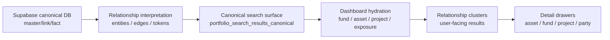

사용자가 보는 핵심은 개별 테이블 row가 아니라 `relationship cluster`다.

```text
검색어: 분당

예전 의도와 충돌하던 형태:
  전체: "분당"이라는 큰 관계 묶음 1개
  자산: 같은 자산명이 여러 번 반복
  일부 자산은 detail 없음

현재 목표 형태:
  전체:
    - 롯데백화점분당점
        자산 1 / 펀드 n / 프로젝트 n / 대주 n / 수익자 n
    - 분당야탑물류센터
        자산 1 / 펀드 n / 프로젝트 n / 대주 n / 수익자 n
    - 분당Hostway IDC
        자산 1 / 펀드 n / 프로젝트 n / 대주 n / 수익자 n

  자산 탭:
    전체와 같은 표시 단위의 자산 목록
```

---

## 2. 제품 화면 구조

### 2.1 데스크톱 레이아웃

```text
┌────────────────────────────────────────────────────────────────────────────┐
│ IGIS RA Insight                                                            │
├───────────────────────────────┬────────────────────────────────────────────┤
│ Left Panel                    │ Right Detail Panel                         │
│                               │                                            │
│ [데이터 조회] [종합 분석]      │  선택 전                                  │
│                               │  ┌──────────────────────────────────────┐  │
│ 검색 및 조회 (?)              │  │ 리스트에서 항목을 선택하면             │  │
│ ┌───────────────────────────┐ │  │ 상세 정보가 여기에 표시됩니다.        │  │
│ │ 🔍 검색어 입력             │ │  └──────────────────────────────────────┘  │
│ └───────────────────────────┘ │                                            │
│                               │  선택 후                                  │
│ [전체] [펀드] [자산] [프로젝트]│  ┌──────────────────────────────────────┐  │
│ [수익자] [대주]               │  │ RELATIONSHIP CLUSTER / ASSET DETAIL   │  │
│                               │  │ 연결 자산 / 펀드 / 프로젝트 / 기관     │  │
│ 결과 카드 리스트              │  │ 상세 테이블 / 지도 / 익스포저          │  │
│ ┌───────────────────────────┐ │  └──────────────────────────────────────┘  │
│ │ RELATION / ASSET / FUND   │ │                                            │
│ └───────────────────────────┘ │                                            │
└───────────────────────────────┴────────────────────────────────────────────┘
```

### 2.2 모바일 레이아웃

```text
┌────────────────────────────┐
│ IGIS RA Insight            │
├────────────────────────────┤
│ [데이터 조회] [종합 분석]   │
├────────────────────────────┤
│ 검색창                     │
├────────────────────────────┤
│ 가로 스크롤 탭             │
│ [전체] [펀드] [자산] ...   │
├────────────────────────────┤
│ 카드 리스트                │
│ ┌────────────────────────┐ │
│ │ 자산/관계 카드          │ │
│ │ 펀드 n / 프로젝트 n     │ │
│ └────────────────────────┘ │
├────────────────────────────┤
│ 카드 선택 시 detailPanel로 │
│ inline 상세 렌더링         │
└────────────────────────────┘
```

---

## 3. Repo File Map

```mermaid
flowchart TD
    R["RA dashboard repo"] --> P["01. RA Portal/portfolio-analysis"]
    R --> M["01. RA Portal/migrations"]
    R --> T["01. RA Portal/tools/data-reconciliation"]
    R --> D["docs"]

    P --> I["index.html<br/>layout shell"]
    P --> A["app.js<br/>view toggle / input / tabs"]
    P --> C["config.js<br/>Supabase URL/key"]
    P --> Core["js/core.js<br/>client / helpers / bulk load"]
    P --> Search["js/search-results.js<br/>search + cluster rendering"]
    P --> Asset["js/asset-canonical.js<br/>asset cards/detail"]
    P --> Drawer["js/detail-drawer.js<br/>fund/project/party drawers"]
    P --> Analytics["js/analytics-dashboard.js<br/>AUM analytics"]
    P --> CSS["style.css<br/>responsive visual layer"]

    M --> M1["2026-06-09_relationship_index_v1.sql"]
    M --> M2["2026-06-09_relationship_index_search_cache.sql"]
    M --> M3["2026-06-08_relationship_contract_v1.sql"]
    M --> M4["2026-06-08_portfolio_search_index.sql"]
    M --> M5["2026-06-10_refresh_relationship_caches.sql"]

    T --> V1["verify_dashboard_search_determinism.js"]
    T --> V2["verify_dashboard_cluster_contract_live.js"]
    T --> V3["audit_dashboard_operational_contract.py"]
```

---

## 4. Supabase Relationship Model

### 4.1 Canonical truth

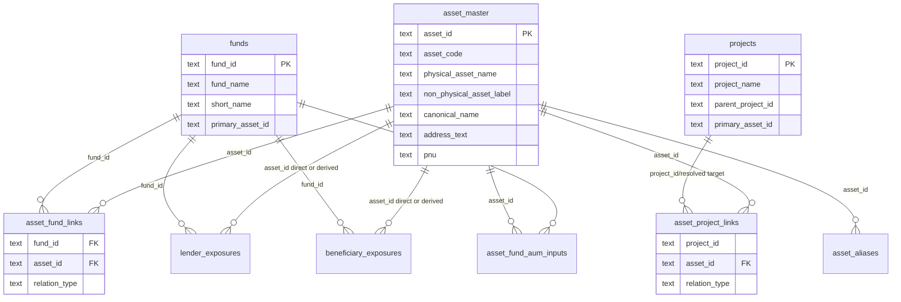

### 4.2 Relationship index layer

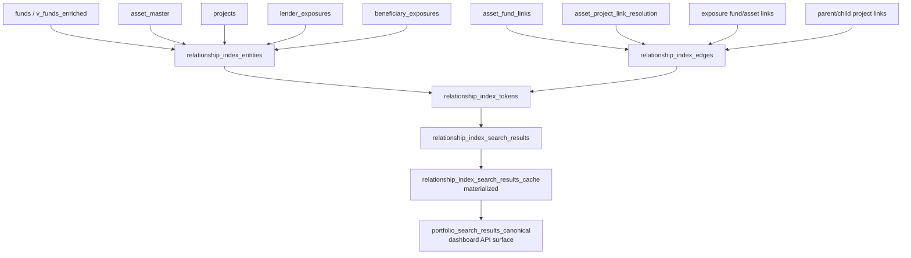

### 4.3 Relation meaning

| Edge / relation | 의미 | 화면에서 쓰임 |
|---|---|---|
| `fund_asset` | 펀드와 자산의 강한 관계 | fund drawer, asset detail, search cluster |
| `project_asset` | 프로젝트와 자산의 해석된 관계 | project drawer, asset detail, project cluster |
| `project_child` | parent project와 child project | IOTA 같은 parent scope 확장 |
| `fund_lender` | 대주 exposure가 fund에 연결 | party cluster, fund drawer |
| `fund_beneficiary` | 수익자 exposure가 fund에 연결 | party cluster, fund drawer |
| `asset_lender` | exposure가 asset에 직접 또는 파생 연결 | asset detail |
| `asset_beneficiary` | exposure가 asset에 직접 또는 파생 연결 | asset detail |

---

## 5. 검색 Query Lifecycle

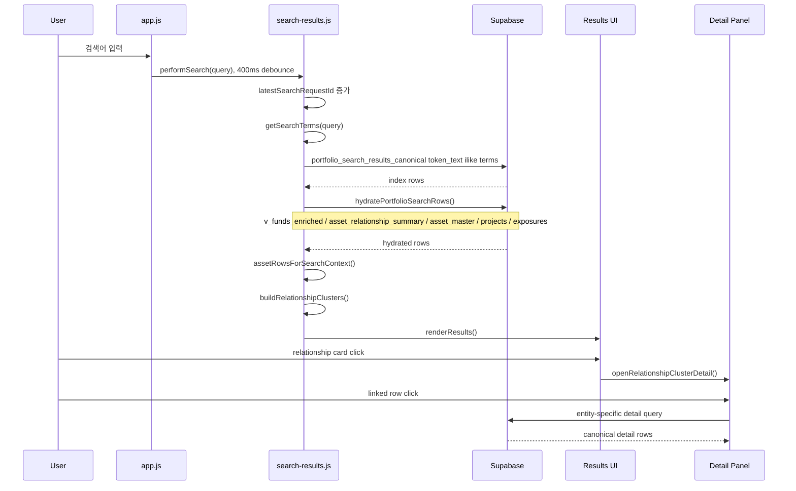

---

## 6. Search Result Decision Tree

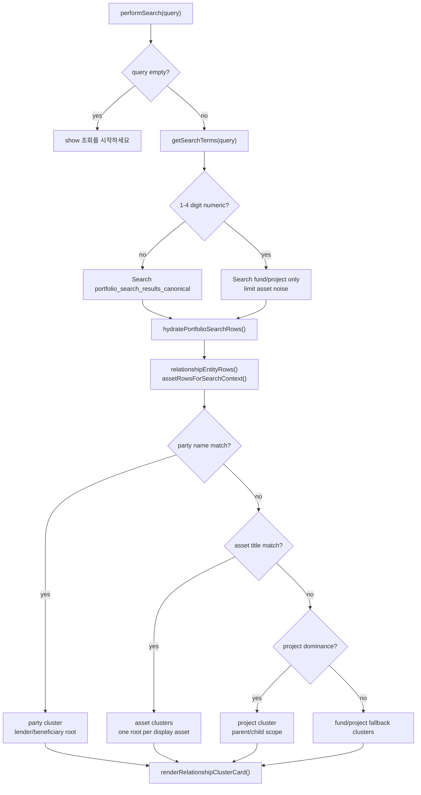

---

## 7. Asset Display Grouping

자산 검색 결과는 `asset_id` 그대로 나열하지 않는다. 같은 실물 자산으로 보이는 row는 표시 단위로 접는다.

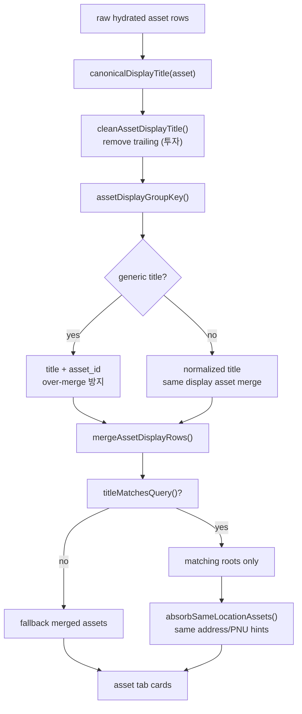

예시:

```text
검색어: 홈플러스

raw:
  홈플러스죽도점
  홈플러스죽도점 (투자)

display:
  홈플러스죽도점
```

```text
검색어: 분당

display roots:
  롯데백화점분당점
  분당야탑물류센터
  분당Hostway IDC

same-location absorbed hint:
  북미DC포트폴리오 -> 분당Hostway IDC 관계 힌트로 흡수
```

---

## 8. Cluster Object Shape

화면의 `전체` 탭은 아래 구조를 카드로 보여준다.

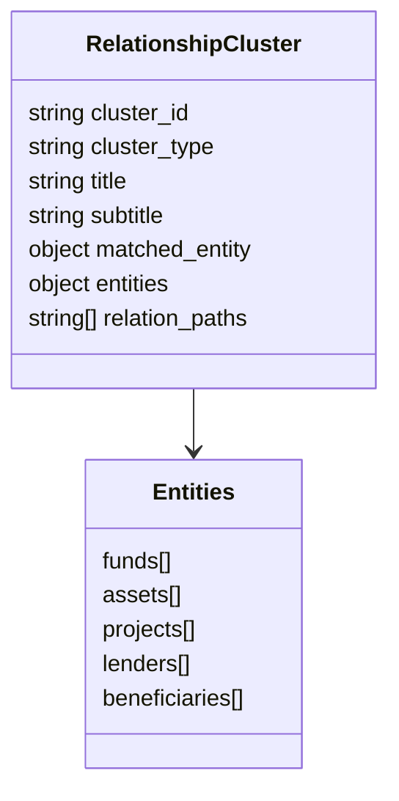

표시 카드:

```text
┌──────────────────────────────────────┐
│ RELATION                             │
│ 롯데백화점분당점                     │
│ 자산 기반 관계 묶음                  │
│                                      │
│ [자산 1] [펀드 4] [프로젝트 5]       │
│                                      │
│ 자산      롯데백화점분당점           │
│ 펀드      [389호] ...                │
│ 프로젝트  롯데백화점 분당점 리모델링 │
└──────────────────────────────────────┘
```

---

## 9. Detail Navigation Map

```mermaid
flowchart TD
    Card["Relationship cluster card"] --> Detail["openRelationshipClusterDetail()"]
    Detail --> AssetRow["연결 자산 row"]
    Detail --> FundRow["연결 펀드 row"]
    Detail --> ProjectRow["연결 프로젝트 row"]
    Detail --> PartyRow["연결 대주/수익자 row"]

    AssetRow --> AssetDetail["AssetCanonical.renderCanonicalAssetDetail(asset_id)"]
    FundRow --> FundDrawer["openFundRelationshipDrawer(fund_id)"]
    ProjectRow --> ProjectDrawer["openProjectRelationshipDrawer(project_id)"]
    PartyRow --> PartyDrawer["openInstitutionRelationshipDrawer(type, name, rows)"]

    AssetDetail --> A1["asset_master"]
    AssetDetail --> A2["asset_building_ledger"]
    AssetDetail --> A3["fund_asset_relationships"]
    AssetDetail --> A4["project_asset_relationships"]
    AssetDetail --> A5["lender_exposures"]
    AssetDetail --> A6["beneficiary_exposures"]
    AssetDetail --> A7["asset_fund_aum_inputs"]

    FundDrawer --> F1["v_funds_enriched"]
    FundDrawer --> F2["fund_asset_relationships"]
    FundDrawer --> F3["lender_exposures"]
    FundDrawer --> F4["beneficiary_exposures"]

    ProjectDrawer --> P1["projects"]
    ProjectDrawer --> P2["child projects"]
    ProjectDrawer --> P3["project_asset_relationships"]
    ProjectDrawer --> P4["fund_asset_relationships by asset"]

    PartyDrawer --> I1["exposure rows"]
    PartyDrawer --> I2["funds by fund_id"]
    PartyDrawer --> I3["assets via fund_asset_relationships"]
```

---

## 10. Dashboard Views

```mermaid
stateDiagram-v2
    [*] --> ListView

    ListView: 데이터 조회
    ListView --> SearchInput: type query
    SearchInput --> SearchResults: canonical search
    SearchResults --> RelationshipDetail: click cluster
    RelationshipDetail --> EntityDetail: click linked row
    EntityDetail --> SearchResults: back

    ListView --> AnalysisView: 종합 분석 click
    AnalysisView: 종합 분석
    AnalysisView --> BulkLoad: ensureAllDataLoaded()
    BulkLoad --> Analytics: renderAnalytics()
    Analytics --> ListView: 데이터 조회 click
```

---

## 11. 데이터 조회 vs 종합 분석

| 영역 | 1차 데이터 소스 | 목적 | 주의점 |
|---|---|---|---|
| 데이터 조회 | `portfolio_search_results_canonical` | 사용자가 기대하는 대상을 찾고 관계를 타고 들어감 | 관계 cluster가 기본 |
| 자산 탭 | hydrated `asset_relationship_summary + asset_master` | 검색 컨텍스트에 맞는 표시 자산 목록 | 같은 표시명/같은 실물 단위 병합 |
| 펀드 탭 | `v_funds_enriched` | 검색에 걸린 fund universe 확인 | 상세은 fund drawer에서 canonical relation 우선 |
| 프로젝트 탭 | `projects` | project/parent-child scope 확인 | project_id = fund_id 혼용은 낮은 fallback |
| 수익자/대주 탭 | exposure tables | 기관 참여 row 확인 | drawer에서 fund/asset relation으로 재추적 |
| 종합 분석 | `ensureAllDataLoaded()`로 bulk `v_funds_enriched`, `fund_assets` | AUM/성장/필터 분석 | 검색 cluster 경로와 별도 |

---

## 12. 주요 함수 지도

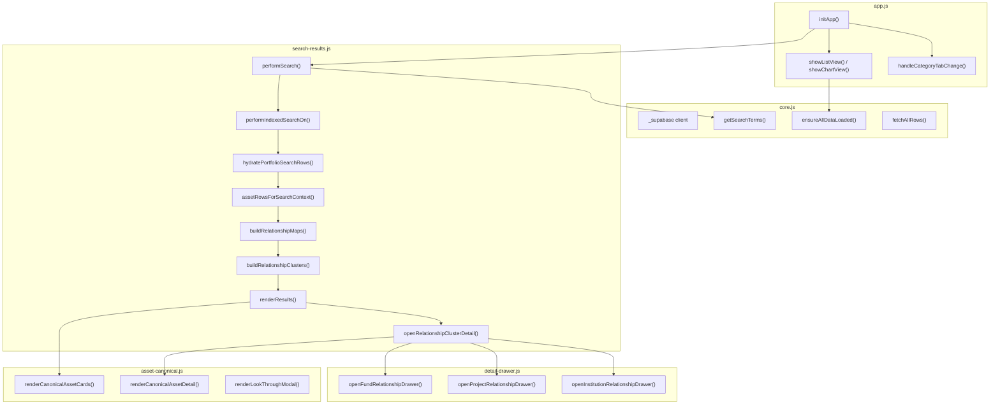

---

## 13. 주요 SQL/View 지도

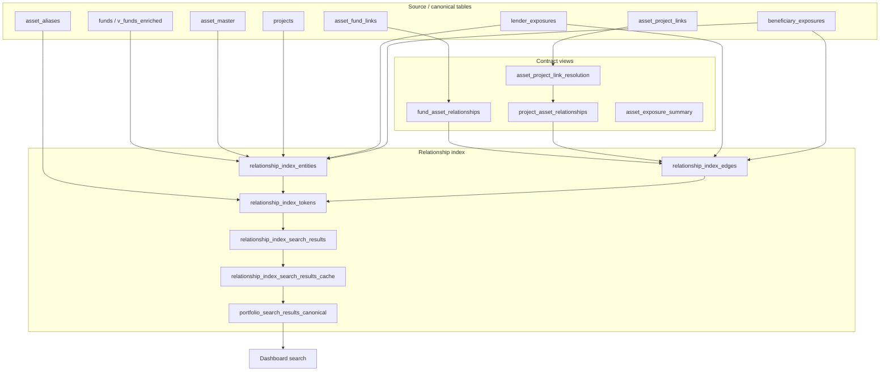

---

## 14. Search Scenarios

### 14.1 Asset-like query

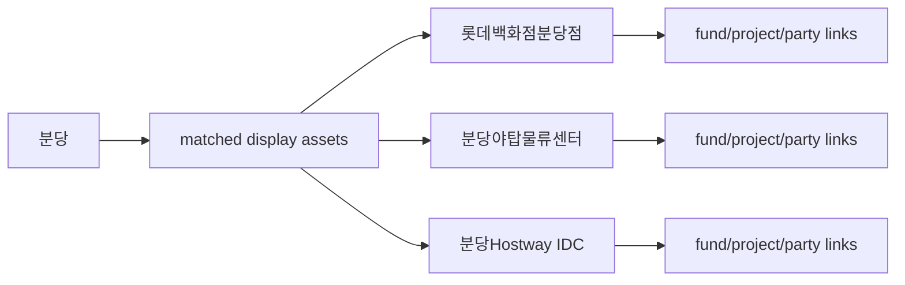

### 14.2 Project-like query

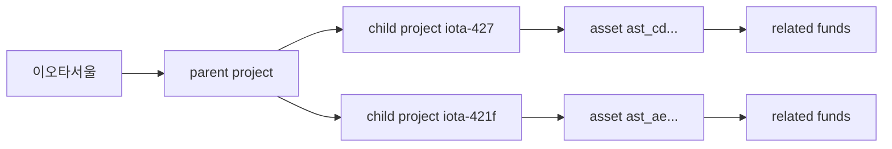

### 14.3 Party-like query

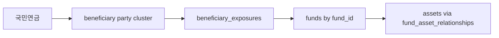

### 14.4 Short numeric query

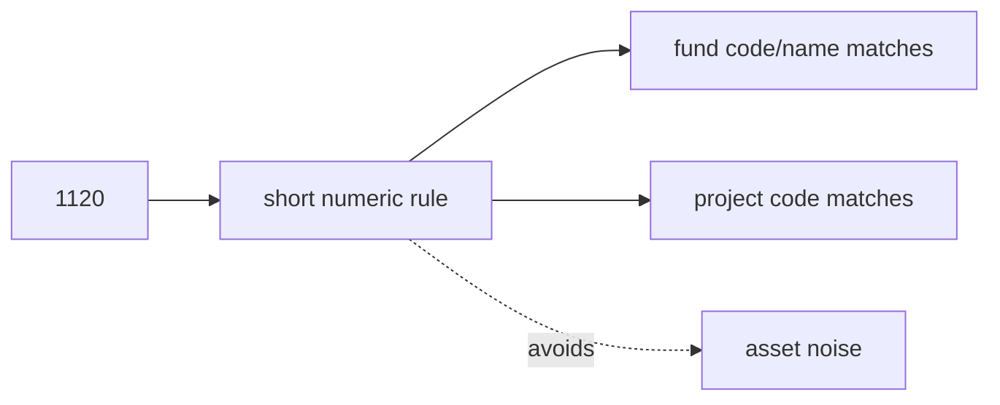

---

## 15. 검색 결과가 중복되지 않기 위한 규칙

| 규칙 | 구현 위치 | 효과 |
|---|---|---|
| 같은 fund는 `fund_id`로 dedupe | `dedupeEntities(..., 'fund')` | 펀드 중복 제거 |
| 같은 project는 `project_id`로 dedupe | `dedupeEntities(..., 'project')` | 프로젝트 중복 제거 |
| 같은 기관은 정규화된 기관명으로 group | `groupEntities()` | 대주/수익자 반복 제거 |
| 같은 표시 자산은 display key로 group | `assetDisplayGroupKey()` | 같은 자산명 반복 제거 |
| `(투자)` suffix 제거 | `cleanAssetDisplayTitle()` | 투자 wrapper row와 실물 row 병합 |
| 같은 위치의 비직접 asset은 힌트로 흡수 | `absorbSameLocationAssets()` | `북미DC포트폴리오` 같은 row가 별도 root로 튀지 않음 |
| 전체 탭은 topic bucket보다 entity root 우선 | `buildRelationshipClusters()` | 큰 검색어도 실제 표시 대상 단위로 출력 |

---

## 16. Verification Map

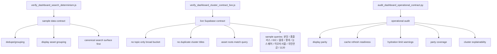

최근 확인된 검증 명령:

```powershell
node --check 01. RA Portal\portfolio-analysis\js\search-results.js
node 01. RA Portal\tools\data-reconciliation\verify_dashboard_search_determinism.js
node 01. RA Portal\tools\data-reconciliation\verify_dashboard_cluster_contract_live.js
python -m py_compile 01. RA Portal\tools\data-reconciliation\audit_dashboard_operational_contract.py
python 01. RA Portal\tools\data-reconciliation\audit_dashboard_operational_contract.py
```

---

## 17. 외부 공유용 최소 설명 문구

```text
RA Dashboard는 Supabase의 fund, asset, project, lender, beneficiary 원천 row를 직접 나열하지 않고,
canonical relationship index를 통해 검색어와 연결된 실제 표시 대상 단위로 결과를 재구성한다.

검색 결과의 기본 단위는 fund/asset/project 개별 row가 아니라 relationship cluster이며,
cluster 안에는 연결 자산, 펀드/비히클, 프로젝트, 대주, 수익자가 함께 들어간다.

자산 검색에서는 같은 실물 자산 또는 같은 표시명으로 판단되는 row를 하나로 접고,
비실물 wrapper나 같은 위치의 포트폴리오 row는 별도 root로 튀지 않도록 관계 힌트로 흡수한다.

상세 조회는 cluster에서 entity_type/entity_id를 따라 canonical drawer로 이동하며,
asset은 asset_id, fund는 fund_id, project는 project_id와 parent/child scope, party는 exposure row와 fund_id를 기준으로 다시 관계를 조회한다.
```

---

## 18. 현재 구조의 핵심 판단

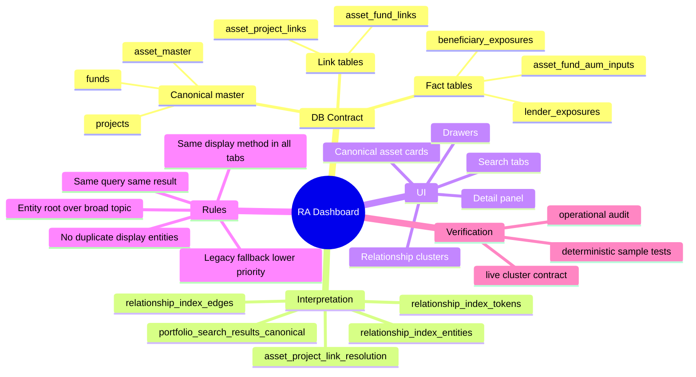
