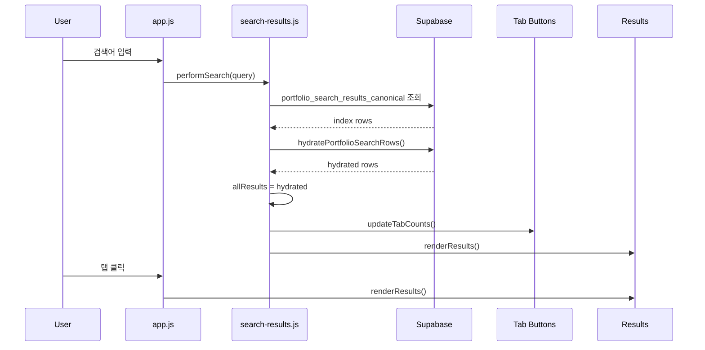

# `updateTabCounts()` Actual Code Note

작성일: 2026-06-10
원본 파일: `01. RA Portal/portfolio-analysis/js/search-results.js`
원본 위치: `updateTabCounts()` 함수

---

## 1. 실제 코드

```js
function updateTabCounts() {
  var terms = getSearchTerms(window.currentSearchQuery || '');
  var assetRows = assetRowsForSearchContext(allResults.assetGroups && allResults.assetGroups.length ? allResults.assetGroups : allResults.assets, terms);
  var assetCount = assetRows.length;
  var entityTotal = allResults.lenders.length
    + allResults.beneficiaries.length
    + allResults.funds.length
    + assetCount
    + allResults.projects.length;
  var counts = {
    all: entityTotal,
    fund: allResults.funds.length,
    asset: assetCount,
    ben: allResults.beneficiaries.length,
    lender: allResults.lenders.length,
    project: allResults.projects.length
  };

  tabBtns.forEach(function (btn) {
    var tab = btn.dataset.tab;
    var count = counts[tab] || 0;
    // 최초 1회만 원본 라벨 저장
    if (!btn.dataset.label) {
      btn.dataset.label = btn.textContent.trim();
    }
    var label = btn.dataset.label;
    btn.innerHTML = '<span>' + label + '</span><span class="tab-count">' + count + '</span>';
  });
}
```

---

## 2. 이 함수가 하는 일

`updateTabCounts()`는 검색 결과가 바뀔 때 탭별 숫자를 다시 계산해 버튼 UI에 넣는다.

```text
전체 n
펀드 n
자산 n
프로젝트 n
수익자 n
대주 n
```

핵심은 `전체`와 `자산` 숫자를 단순 raw row 개수가 아니라 현재 검색 출력 규칙에 맞춰 계산한다는 점이다.

---

## 3. Count 계산 기준

```js
var terms = getSearchTerms(window.currentSearchQuery || '');
```

현재 검색어를 검색 token으로 변환한다.

```js
var assetRows = assetRowsForSearchContext(
  allResults.assetGroups && allResults.assetGroups.length ? allResults.assetGroups : allResults.assets,
  terms
);
```

자산 숫자는 raw asset row가 아니라 현재 검색 문맥의 표시 자산 단위로 계산한다.

예:

```text
홈플러스죽도점
홈플러스죽도점 (투자)
```

위 두 row가 있더라도 자산 탭 count는 2가 아니라 1이 되어야 한다.

```js
var entityTotal = allResults.lenders.length
  + allResults.beneficiaries.length
  + allResults.funds.length
  + assetCount
  + allResults.projects.length;
```

전체 탭 count는 relationship cluster 개수가 아니라, 탭별 entity 개수 합산을 사용한다.

즉 전체 탭의 숫자는:

```text
lender + beneficiary + fund + displayed asset + project 합산
```

---

## 4. `counts` 객체

```js
var counts = {
  all: entityTotal,
  fund: allResults.funds.length,
  asset: assetCount,
  ben: allResults.beneficiaries.length,
  lender: allResults.lenders.length,
  project: allResults.projects.length
};
```

| Key | 탭 | 계산 기준 |
|---|---|---|
| `all` | 전체 | 모든 hydrated entity 합산. 단 asset은 displayed asset root 기준 |
| `fund` | 펀드 | `allResults.funds.length` |
| `asset` | 자산 | `assetRowsForSearchContext(...).length` |
| `project` | 프로젝트 | `allResults.projects.length` |
| `ben` | 수익자 | `allResults.beneficiaries.length` |
| `lender` | 대주 | `allResults.lenders.length` |

---

## 5. DOM 업데이트

```js
tabBtns.forEach(function (btn) {
  var tab = btn.dataset.tab;
  var count = counts[tab] || 0;
  if (!btn.dataset.label) {
    btn.dataset.label = btn.textContent.trim();
  }
  var label = btn.dataset.label;
  btn.innerHTML = '<span>' + label + '</span><span class="tab-count">' + count + '</span>';
});
```

각 탭 버튼은 HTML에서 `data-tab` 값을 가진다.

```html
<button class="tab-btn active" data-tab="all">전체</button>
<button class="tab-btn" data-tab="fund">펀드</button>
<button class="tab-btn" data-tab="asset">자산</button>
<button class="tab-btn" data-tab="project">프로젝트</button>
<button class="tab-btn" data-tab="ben">수익자</button>
<button class="tab-btn" data-tab="lender">대주</button>
```

`updateTabCounts()` 실행 후에는 대략 이렇게 바뀐다.

```html
<button class="tab-btn active" data-tab="all" data-label="전체">
  <span>전체</span><span class="tab-count">3</span>
</button>
```

`btn.dataset.label`을 저장하는 이유는, 한번 count span이 붙은 뒤 다음번에 `btn.textContent`를 그대로 쓰면 `전체3` 같은 값이 label로 굳어질 수 있기 때문이다.

---

## 6. 의존 값/함수

| 이름 | 위치 | 역할 |
|---|---|---|
| `window.currentSearchQuery` | `search-results.js` | 현재 검색어 |
| `allResults` | `core.js`, `search-results.js` | hydration된 검색 결과 |
| `tabBtns` | `core.js` | `.tab-btn` DOM 목록 |
| `getSearchTerms()` | `core.js` | 검색어 token화 |
| `assetRowsForSearchContext()` | `search-results.js` | 현재 검색어 기준 표시 자산 목록 산정 |
| `buildRelationshipClusters()` | `search-results.js` | 전체 탭에 보여줄 관계 cluster 생성 |

---

## 7. 호출 위치

실제 호출은 `search-results.js` 안에서 일어난다. 핵심은 `allResults`가 새로 세팅된 직후 `updateTabCounts()`를 먼저 실행하고, 그 다음 `renderResults()`로 카드를 다시 그리는 순서다.

### 7.1 검색 input에서 시작

파일: `01. RA Portal/portfolio-analysis/app.js`

```js
if (searchInput) {
  searchInput.addEventListener('input', function (event) {
    clearTimeout(debounceTimer);
    debounceTimer = setTimeout(function () {
      if (typeof performSearch === 'function') {
        performSearch(event.target.value);
      }
    }, 400);
  });
}
```

사용자가 검색창에 입력하면 400ms debounce 후 `performSearch()`가 호출된다.

```text
사용자 입력
  -> app.js input event
  -> performSearch(query)
```

### 7.2 Canonical 검색 성공 후

파일: `01. RA Portal/portfolio-analysis/js/search-results.js`

```js
performSearch(query)
  -> performIndexedSearch(...)
  -> allResults = hydrated
  -> updateTabCounts()
  -> renderResults()
```

실제 코드:

```js
return performIndexedSearch(query, terms).then(function (hydrated) {
  if (requestId !== latestSearchRequestId) return;
  allResults = hydrated;
  window.allResults = allResults;
  updateTabCounts();
  renderResults();
}).catch(function (error) {
  if (requestId !== latestSearchRequestId) return;
  window.searchContractMode = 'legacy_fallback';
  console.warn('portfolio_search_index unavailable; using legacy search path.', error);
  return performLegacySearch(query, requestId);
});
```

이때 `updateTabCounts()`는 방금 hydrate된 `allResults`를 기준으로 탭 숫자를 계산한다.

```text
portfolio_search_results_canonical
  -> hydratePortfolioSearchRows()
  -> allResults
  -> updateTabCounts()
  -> renderResults()
```

### 7.3 빈 검색어 처리

파일: `01. RA Portal/portfolio-analysis/js/search-results.js`

```js
if (!query) {
  resultsContainer.innerHTML = '<div class="no-results">조회를 시작하세요.</div>';
  updateTabCounts();
  return Promise.resolve();
}
```

검색어가 비어 있으면 결과 리스트를 초기 메시지로 바꾸고 탭 숫자도 초기 상태에 맞춰 다시 쓴다.

### 7.4 Legacy fallback 검색 성공 후

canonical 검색 surface가 실패하면 `performLegacySearch()`로 내려간다. 여기서도 결과를 `allResults`에 넣은 뒤 같은 순서로 호출한다.

```js
performLegacySearch(query, requestId)
  -> allResults = {...}
  -> updateTabCounts()
  -> renderResults()
```

실제 코드:

```js
allResults = {
  lenders: dedupeEntities(lenderRes.data || [], 'lender'),
  beneficiaries: dedupeEntities(benRes.data || [], 'ben'),
  funds: dedupeEntities(normalFunds, 'fund'),
  assets: window.AssetCanonical ? [] : (assetRes.data || []),
  projects: dedupeEntities(projects.concat(projectRes.data || []), 'project'),
  assetGroups: window.AssetCanonical ? dedupeEntities(assetRes.data || [], 'asset') : [],
  _indexRows: []
};
window.allResults = allResults;

updateTabCounts();
renderResults();
```

### 7.5 탭 클릭 시에는 호출하지 않음

파일: `01. RA Portal/portfolio-analysis/app.js`

```js
function handleCategoryTabChange(nextTab, tabButtons) {
  var results = document.getElementById('results');
  var analysisResults = document.getElementById('analysisResults');

  setActiveTab(tabButtons, nextTab);

  setDisplay(results, 'flex');
  setDisplay(analysisResults, 'none');

  if (typeof renderResults === 'function') {
    renderResults();
  }
}
```

탭을 누를 때는 `updateTabCounts()`를 다시 부르지 않는다.

이유:

```text
탭 숫자:
  검색 결과 allResults 기준으로 이미 계산되어 있음

탭 클릭:
  같은 allResults를 다른 탭 필터로 보여주는 동작
  그래서 renderResults()만 호출
```

---

## 7-1. 실제 사용 순서 그림



---

## 8. 현재 구조에서 중요한 이유

이 함수는 단순히 숫자를 세는 함수처럼 보이지만, 현재 대시보드에서는 검색 결과의 해석 방식과 직접 연결된다.

특히 다음 두 숫자가 중요하다.

```text
전체 count:
  relationship cluster 개수 X
  fund + displayed asset + project + lender + beneficiary entity 합산 O

자산 count:
  raw asset_id 개수 X
  display asset root 개수 O
```

그래서 `분당`, `홈플러스`, `물류`처럼 넓은 검색어에서 탭 숫자가 실제 카드 개수와 다르게 보이지 않도록 하는 핵심 연결점이다.
