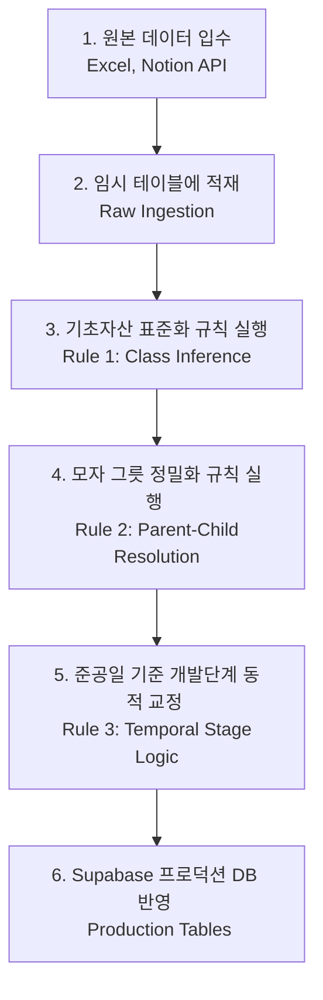

# 이지스 RA 대시보드 데이터베이스 구축 및 정합성 표준 정의서 (Database Normalization Standards Spec)

본 문서는 이지스 RA 포트폴리오 분석 대시보드의 데이터 무결성(Data Integrity)을 100% 보장하고, AUM 중복 계산 및 필터 오류를 원천 차단하기 위해 데이터베이스를 **최초 설계하거나 원본 데이터를 업데이트할 때 반드시 준수해야 하는 표준 가이드라인**입니다.

이 지침은 원본 로우 데이터(Excel, Notion 원장 등)로부터 관계형 데이터베이스(Supabase 등 SQL DB)를 처음부터 재구축할 때의 **ETL 설계 사양서 및 데이터 검증 가이드북** 역할을 수행합니다.

---

## 📌 1. 데이터베이스 핵심 스키마 사양 (Schema Specifications)

부동산 펀드와 실물 자산 간의 1:N 관계를 완벽히 매핑하기 위해 아래의 이중 레이어 테이블 구조를 유지합니다.

### 1.1 `funds` (펀드 마스터 테이블)
펀드의 기본 설정 정보 및 재무 데이터를 저장하며, 필터 검색을 지원하는 정규화된 태그 컬럼을 포함합니다.

| 물리 컬럼명 | 타입 | 제약 조건 | 설명 |
| :--- | :---: | :---: | :--- |
| `fund_id` | VARCHAR | PRIMARY KEY | 이지스 내부 관리용 고유 펀드 코드 (6자리 숫자 등) |
| `fund_name` | VARCHAR | NOT NULL | 펀드 공식 명칭 (예: 이지스일반사모부동산자투자신탁...) |
| `parent_fund_id` | VARCHAR | NULL, FK | 모펀드 ID (모자 관계 직접 추적용, FK to `funds.fund_id`) |
| `notion_base_asset_class` | VARCHAR | NULL | **기초자산 분류** (오피스, 물류센터, 리테일, 호텔, 주거 등) |
| `notion_holding_type_class` | VARCHAR | NULL | **모자 구분** (모펀드, 자펀드, 프로젝트펀드, 독립펀드) |
| `notion_business_stage_class` | VARCHAR | NULL | **사업 단계** (운영/실물, 개발) |
| `metadata` | JSONB | NULL | 기타 메타 속성들의 통합 블록 (유연한 확정용) |

### 1.2 `fund_assets` (펀드 연결 실물자산 테이블)
펀드가 실제로 담고 있는 실물 부동산 자산의 스펙과 지리 정보를 저장합니다.

| 물리 컬럼명 | 타입 | 제약 조건 | 설명 |
| :--- | :---: | :---: | :--- |
| `id` | BIGINT | PRIMARY KEY | 자동 증가 고유 ID |
| `fund_id` | VARCHAR | NOT NULL, FK | 해당 자산을 취득한 펀드 ID (FK to `funds.fund_id`) |
| `asset_name` | VARCHAR | NOT NULL | 자산 공식 명칭 (예: 아레나스양지물류센터) |
| `main_usage` | VARCHAR | NULL | 건축물대장상 주용도 (예: 업무시설, 창고시설) |
| `completion_date` | DATE | NULL | 준공연월일 (YYYY-MM-DD 포맷 필수) |
| `address` | VARCHAR | NULL | 표준 지번/도로명 주소 |
| `lat` / `lng` | NUMERIC | NULL | 지도의 정확한 좌표 찍기를 위한 위경도 값 |
| `metadata` | JSONB | NULL | 개별 자산의 상세 건축 정보 블록 |

---

## ⚙️ 2. 데이터 유입 및 정규화 파이프라인 (ETL Pipeline)

원본 원장 데이터를 가공하여 프로덕션 데이터베이스에 밀어 넣을 때 아래 흐름도로 정합성 보정이 수행되어야 합니다.



---

## 📐 3. 핵심 3대 정합성 보정 규칙 (The 3 Canonical Rules)

이 부분이 원본 데이터를 완전히 처음부터 재정렬하더라도 **포트폴리오의 중복과 유실을 막아주는 핵심 규칙**입니다.

### [Rule 1] 기초자산 분류 자동 추론 규칙 (Base Asset Class Inference)
`funds.notion_base_asset_class`가 비어있을 경우, 연동된 자식 테이블인 `fund_assets`의 주용도(`main_usage`) 및 자산명을 기반으로 NLP 매핑을 통해 대분류를 강제 표준화합니다.

```python
# 표준 NLP 키워드 맵핑 사전
class_inference_dictionary = {
    '오피스': ['업무', '업무시설', '오피스', '빌딩', '사옥'],
    '물류센터': ['물류', '창고', '물류센터', '로지스'],
    '리테일': ['판매', '리테일', '상업', '판매시설', '복합쇼핑몰', '마트', '아울렛'],
    '호텔': ['숙박', '호텔', '콘도', '리조트'],
    '주거': ['주거', '공동주택', '오피스텔', '아파트', '하우징'],
    '데이터센터': ['데이터센터', 'IDC', '서버룸']
}
```
*   **처리지침:** 자식 자산의 `main_usage` 또는 `asset_name`에 위의 특정 단어가 포함되어 있다면, 부모 펀드의 `base_asset_class`를 해당 표준 분류로 자동 지정합니다. 만약 한 펀드가 두 개 이상의 자산군을 가질 경우, 콤마(`,`)로 결합하여 기록합니다(예: `오피스, 리테일`).

---

### [Rule 2] 모자(母子) 그릇 분류 규칙 (Parent-Child Resolution)
AUM 계산 시 펀드 설정액이 중복 카운팅(Double-Counting)되는 대형 금융 재해를 방지하기 위한 안전장치입니다.

*   **판별 메커니즘 (명칭 기반 정밀 매핑):**
    1.  펀드명에 **"모투자"** 또는 **"모부동산"**이 들어갈 경우 ➔ 무조건 **`모펀드`**로 분류.
    2.  펀드명에 **"자투자"** 또는 **"자부동산"**이 들어갈 경우 ➔ 무조건 **`자펀드`**로 분류.
    3.  펀드명에 **"프로젝트"**, **"PFV"**, **"피에프브이"**가 들어갈 경우 ➔ **`프로젝트펀드`**로 분류.
    4.  그 외 일반 개별 설정 펀드 ➔ **`독립펀드`**로 분류.

> [!WARNING]
> **AUM 합산 안전 공식 (AUM Summation Invariant):**
> 대시보드와 보고서에서 운용 AUM 총합을 집계할 때는 반드시 아래 조건으로 필터링을 수행해야 합니다.
> ```sql
> SELECT SUM(committed_amount) 
> FROM funds 
> WHERE notion_holding_type_class != '모펀드';
> ```
> 모펀드를 합산 대상에서 영구적으로 제외하지 않으면, 해당 자금이 자펀드와 SPC에 재투자되는 과정에서 AUM 통계가 실제의 2~3배로 튀어 오르게 됩니다.

---

### [Rule 3] 사업 단계 실시간 동적 교정 규칙 (Temporal Business Stage Normalization)
기존 정적 문서에 명시된 "개발" 단계 꼬리표를 믿지 말고, **현재 조회를 수행하는 당일 기준선(Today Line)**과 자산의 **준공연월일**을 기하학적으로 비교하여 실시간 가변 상태로 보정합니다.

1.  **동적 교정 핵심 로직:**
    *   $\text{준공연월일} \le \text{조회 시점 (현재 일자)}$ ➔ **`운영/실물`** (Operational/Real Asset)로 자동 보정 및 승격.
    *   $\text{준공연월일} > \text{조회 시점 (현재 일자)}$ ➔ **`개발`** (Development) 단계를 정밀 고수.
2.  **도입 배경:** 원본 원장 데이터는 과거에 작성된 상태 그대로 정체되어 있어, 이미 완공되어 운영 중인 "야탑쿠팡물류(2023년 준공)"조차 여전히 원본 명부에는 "개발"로 박혀있는 중대한 시계열 오류를 완전히 해결해 줍니다.

---

## 🔍 4. 펀드 구축 시 데이터 무결성 체크리스트 (Ingestion Checklist)

새로운 데이터를 적재할 때는 아래 5대 규칙의 준수 여부를 무조건 통과해야 배포가 가능합니다.

- [ ] **1. ID 무결성:** 모든 펀드 레코드는 유일무이한 `fund_id`를 가져야 하며 외래키 관계가 깨지지 않아야 한다.
- [ ] **2. 준공연월 형식 정형화:** 실물 자산의 `completion_date`가 문자열(`'24년05월'`)이나 공란으로 오지 않고, 반드시 `YYYY-MM-DD` 표준 날짜 형식으로 변환 적재되었다.
- [ ] **3. 기초자산 완전성:** `base_asset_class`가 비어있는 펀드가 한 개도 존재하지 않으며, 만약 비어있다면 `Rule 1`에 의해 자식의 스펙을 파싱해 보완되었다.
- [ ] **4. 모자 구분 완료:** 펀드 마스터 테이블의 `notion_holding_type_class`가 공란 없이 `모펀드`, `자펀드`, `독립펀드`, `프로젝트펀드` 중 하나로 100% 분배 지정되었다.
- [ ] **5. 위경도 유효성:** 실물 자산 주소지에 매핑된 위경도 좌표(`lat`, `lng`)가 유효 범위(대한민국 기준 위도 33~39, 경도 124~132) 안에 위치하여 지도상에 찍힐 수 있다.
