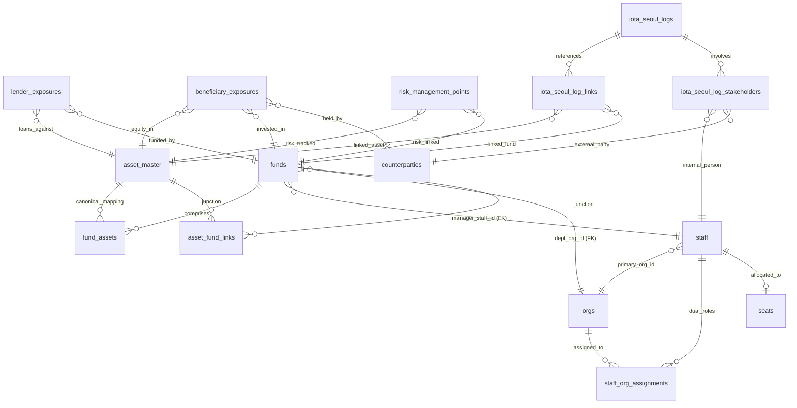

# 이지스 RA 통합 데이터베이스 시스템 아키텍처 및 정합성 표준 정의서 (CRM Enterprise DB Architecture Blueprint)

본 정의서는 이지스 RA 포트폴리오 분석 대시보드, T5T 자금 집행 검토, 그리고 리스크 인텔리전스 시스템 전반을 아우르는 **통합 엔터프라이즈 데이터 모델 사양서**입니다.

이 사양서는 이지스 RA 데이터 시스템을 최초 설계 사양에 맞게 바닥부터 다시 구축(Re-build)하거나 신규 테이블 추가 및 마이그레이션을 진행할 때 엔지니어링팀이 무조건 준수해야 하는 **최상위 표준 지침서** 역할을 수행합니다.

---

## 🏛️ 1. 통합 아키텍처 개요 및 5대 도메인 설계 (Domain Overview)

이지스 RA 시스템의 전체 데이터베이스는 논리적 기능과 원천 데이터의 속성에 따라 **5개의 핵심 도메인 영역**으로 나누어 설계되었습니다.

```text
┌─────────────────────────────────────────────────────────────────────────────┐
│                             이지스 RA CRM 5대 도메인                           │
└─────────────────────────────────────────────────────────────────────────────┘
  1. 자산/펀드/프로젝트 도메인 (Core Portfolio)
     - 실물 자산 원장, 금융 투자 비히클, Notion 프로젝트 정보의 통합 매핑
  2. 조직/좌석/직원 도메인 (Internal Directory)
     - 전사 본부/부/팀 계층 구조, 전 사원 마스터, 겸직 및 좌석 정보 관리
  3. 익스포저/리스크 도메인 (Risk Intelligence)
     - 대출(Lender)/수익자(Beneficiary) Exposure, 자산 리스크 포인트, 거래 상대방 관리
  4. 이오타 파일럿 도메인 (IOTA Activity Engine)
     - 서울권역 딜 소싱 타임라인, 추진 이력(Log), 이해관계자 매핑 정보
  5. T5T 원천 도메인 (Workflow Sources)
     - 자금검토 신청서 일괄 데이터 및 세부 항목 파싱 스토어
```

---

## 📊 2. 전사 데이터 모델 관계도 (ERD)

각 도메인 테이블들 간의 관계와 핵심 외래키(FK) 연동 구도는 다음과 같습니다.



---

## 📂 3. 도메인별 세부 스키마 및 연동 규칙 (Domain Specifications)

### 3.1 자산/펀드/프로젝트 도메인 (Portfolio Core)
실물 부동산과 그에 수반되는 펀드 금융 정보를 연결해 주는 핵심 영역입니다.

#### [NEW/RESET] `asset_master` (자산 마스터 테이블)
*   **역할:** 전사 실물 부동산의 단일 진실 공급원(Single Source of Truth).
*   **스키마 구성:**
    *   `asset_id` (VARCHAR, PK): 자산 고유 식별 코드 (`ast_` 프리픽스 권장).
    *   `asset_name` (VARCHAR): 표준 자산명 (예: 시그니쳐타워).
    *   `address` (VARCHAR): 지번 주소 및 도로명 주소.
    *   `lat` / `lng` (NUMERIC): 지도 시각화용 위경도.
    *   `pnu_code` (VARCHAR): 공공 데이터 매핑용 표준 PNU 코드.
    *   `gfa` (NUMERIC): 연면적(평/㎡ 단위 정형화 필수).

#### [MODIFY] `funds` (펀드 및 비히클 테이블)
*   **역할:** 투자 비히클 마스터.
*   **스키마 구성:**
    *   `fund_id` (VARCHAR, PK): 고유 펀드 번호 (6자리 코드).
    *   `fund_name` (VARCHAR): 펀드 공식 명칭.
    *   `manager_staff_id` (VARCHAR, FK): 담당 운용역 사번 키 (`staff.staff_id` 연동).
    *   `dept_org_id` (VARCHAR, FK): 담당 소속 부서 조직 코드 (`orgs.org_id` 연동).
    *   `notion_base_asset_class` (VARCHAR): 기초자산 분류 (오피스, 물류센터, 호텔 등).
    *   `notion_holding_type_class` (VARCHAR): 모자 구분 (모펀드, 자펀드 등).
    *   `notion_business_stage_class` (VARCHAR): 사업 단계 (운영/실물, 개발).

#### [MODIFY] `fund_assets` (펀드 자산 취득 스냅샷)
*   *주의:* 이 테이블은 과거 Notion 등에서 단순 적재된 원천 이력 테이블입니다. 신규 화면 개발 시에는 이 테이블을 직접 참조하기보다 `asset_master`와 `asset_fund_links`를 경유하도록 설계를 제한합니다.

---

### 3.2 조직/직원/좌석 도메인 (Internal Directory)
시스템 내부 사용자 및 부서 조직 계층을 정의하며, 보안 권한 및 담당자 연결에 사용됩니다.

> [!IMPORTANT]
> **사람 및 조직 키 관리 대원칙 (The Directory Principle):**
> 1. 모든 사람의 고유 연결 키는 이름 텍스트가 아닌 사번 및 시스템 ID인 **`staff.staff_id`**를 사용합니다.
> 2. 모든 조직의 연결은 부서명이 아닌 표준화된 **`orgs.org_id`**를 사용합니다.
> 3. 이름이나 조직명은 단순 표시용(Display Value)일 뿐이며 동명이인, 개명, 겸직, 부서 통폐합에 따른 무결성 오류를 차단하기 위해 외래키 조인 키로 절대 사용을 금지합니다.

#### [NEW] `staff` (사원 마스터 테이블)
*   **사번 체계:** 사번이 존재하는 임직원은 `staff_emp_<사번>` 형식을 취하고 사번이 없는 미확인 인원은 이메일 및 해시화된 `staff_name_<hash>`를 고유 키로 발급하여 사번 확보 시 병합 처리합니다.
*   **퇴사자 처리 규정:** 퇴사자가 발생하더라도 과거 T5T 폼 신청 이력 및 펀드 운용역 서명 정보의 참조 무결성(Referential Integrity)을 유지하기 위해 **데이터 로우를 삭제하지 않고** `status = 'inactive'` 및 `leave_date`를 기록해 논리적 배제 처리합니다.

---

### 3.3 익스포저/리스크 도메인 (Risk Intelligence)
이지스 포트폴리오의 실질 금융 노출액(Exposure)과 여신 리스크 평가 정보를 제공합니다.

*   `lender_exposures` (대출 익스포저): 펀드가 조달한 은행권 대출금 상태 기록.
*   `beneficiary_exposures` (수익자 익스포저): 외부 기관투자자(NPS, 공제회 등)의 자본 참여 현황을 담으며, `counterparties.id`와 강하게 연결됩니다.
*   `risk_management_points` (리스크 포인트): 자산 및 펀드별 신용 연장 횟수, 리스크 지수를 기록하여 RM 대시보드와 직결됩니다.

---

### 3.4 이오타 파일럿 도메인 (Activity Engine)
서울 권역 내 주요 부동산 딜에 관한 영업 활동 일지와 외부 이해관계자 네트워킹 정보를 매핑합니다.

*   `iota_seoul_logs` (타임라인 로그): 딜 소싱 활동 일지 기록.
*   `iota_seoul_log_links`: 개별 활동 일지가 궁극적으로 수렴된 `asset_master.asset_id` 또는 `funds.fund_id`와 다대다(N:M)로 브릿지 처리됩니다.
*   `iota_seoul_log_stakeholders`: 해당 딜 소싱 회의에 배석한 사내 임직원(`staff_id`) 및 외부 거래처 인사(`counterparties.id`)를 관계형으로 추적합니다.

---

## 📐 4. 데이터 정규화 및 가변 보정 규칙 (Rule Engine)

이 규칙은 원본 파일(Notion 데이터, Excel Raw 등)을 최초 주입하거나 주기적으로 일괄 동기화할 때 **원천 데이터의 수동 분류 누락 및 시계열 낙후성을 덮어써주는 3대 엔진**입니다.

### [Rule 1] 기초자산 분류 자동 추론 규칙 (Base Asset Class Inference)
*   **대상:** `funds.notion_base_asset_class`가 비어있거나 불분명한 경우.
*   **가동 엔진:** 연계된 실물 자산(`fund_assets` 또는 `asset_master`)의 `main_usage` 및 명칭 텍스트를 파싱하여 표준 자산 유형을 복원합니다.
    *   `업무 / 업무시설 / 오피스 / 빌딩 / 사옥` ➔ **`오피스`** 지정
    *   `물류 / 창고 / 물류센터 / 로지스` ➔ **`물류센터`** 지정
    *   `판매 / 리테일 / 상업 / 마트 / 쇼핑몰` ➔ **`리테일`** 지정
    *   `숙박 / 호텔 / 리조트 / 콘도` ➔ **`호텔`** 지정
    *   `주거 / 공동주택 / 오피스텔 / 아파트` ➔ **`주거`** 지정
    *   `데이터센터 / IDC` ➔ **`데이터센터`** 지정

### [Rule 2] 모자(母子) 그릇 분류 및 AUM 이중 계산 방지 규칙 (Parent-Child Resolution)
*   **대상:** 펀드의 모집액(Committed Amount) 합산 시 발생하는 중복 집계 차단.
*   **명칭 기반 자동 맵핑 파서:**
    *   펀드명에 `"모투자"`, `"모부동산"` 포함 ➔ **`모펀드`** 분류
    *   펀드명에 `"자투자"`, `"자부동산"` 포함 ➔ **`자펀드`** 분류
    *   펀드명에 `"프로젝트"`, `"PFV"`, `"피에프브이"` 포함 ➔ **`프로젝트펀드`** 분류
    *   그 외 일반 단독 구조 ➔ **`독립펀드`** 분류
*   **AUM 집계 제약조건 (Strict SQL):**
    대시보드가 총합 운용 AUM을 계산할 때는 절대 모자 펀드를 모두 더해서는 안 되며, **반드시 실질 투자자 공급액을 대변하는 자펀드/독립펀드만 필터링해 더해야 합니다.**
    ```sql
    SELECT SUM(committed_amount) 
    FROM funds 
    WHERE notion_holding_type_class != '모펀드';
    ```

### [Rule 3] 준공일 기반 사업단계 실시간 동적 교정 (Temporal Business Stage Normalization)
*   **대상:** '개발 단계' 상태 값의 장기 낙후 해결.
*   **논리 로직:** 원본 문서 상에 '개발'이라고 고정 기재된 메타데이터를 무조건 맹신하지 않고, 실물 자산의 **`completion_date` (준공 연월일)**과 **조회 당일 일자 (Today Line, 예: 2026-05-06)**를 비교 연산하여 실시간 판정합니다.
    *   $\text{준공일} \le \text{현재 일자}$ ➔ 무조건 **`운영/실물`** 단계로 승격 보정.
    *   $\text{준공일} > \text{현재 일자}$ ➔ **`개발`** 단계 고수.
*   **효과:** 이 규칙을 통하면 과거에 개발 펀드로 시작해 이미 완공되어 입주를 끝마친 다수의 물류센터나 오피스텔이 '개발' 필터에서 자동으로 걸러지고 '운영/실물' 포트폴리오로 정상 편입되어 대시보드 통계의 완벽함을 보장합니다.

---

## 🚀 5. 신규 데이터 입수 시 데이터 무결성 체크리스트 (Ingestion Checklist)

새로운 자산이나 펀드가 등록될 때, 데이터 파이프라인 관리자는 다음 체크리스트를 통과했는지 무조건 검증해야 합니다.

- [ ] **1. ID 정규화:** 모든 엔티티가 누락 없는 Primary Key 및 적절한 프리픽스(`ast_`, `staff_emp_` 등)를 할당받았다.
- [ ] **2. FK 제약 조건 자가 복원:** `funds`의 `manager_staff_id` 및 `dept_org_id`가 실제 디렉토리 테이블의 `staff_id` 및 `org_id`로 정확하게 링킹되어 고립 데이터가 없다.
- [ ] **3. 날짜 규격 통일:** 준공 연월일이 빈 문자열이나 부적절한 한국어 텍스트 대신 `YYYY-MM-DD` 타입의 온전한 DATE 형식으로 입력되었다.
- [ ] **4. AUM 중복 그릇 방어:** 새 펀드의 `notion_holding_type_class`가 4가지 그릇 구조(모펀드, 자펀드, 독립펀드, 프로젝트펀드) 중 하나로 100% 명확하게 정의되어 AUM 중복 통계 유입을 통제한다.
- [ ] **5. 위경도 범위 유효성 검증:** 모든 연동 실물 자산의 `lat`/`lng` 좌표가 지도 표출 한계 바운더리(위도 33~39, 경도 124~132) 내부의 실수값으로 존재한다.
